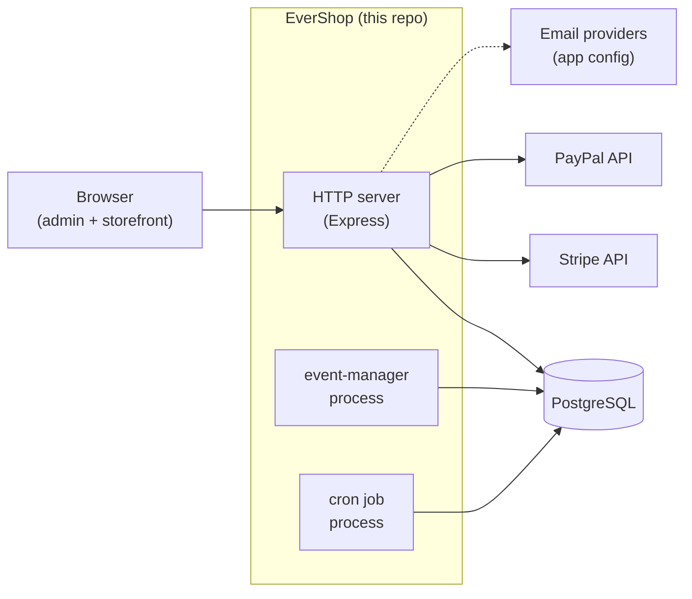
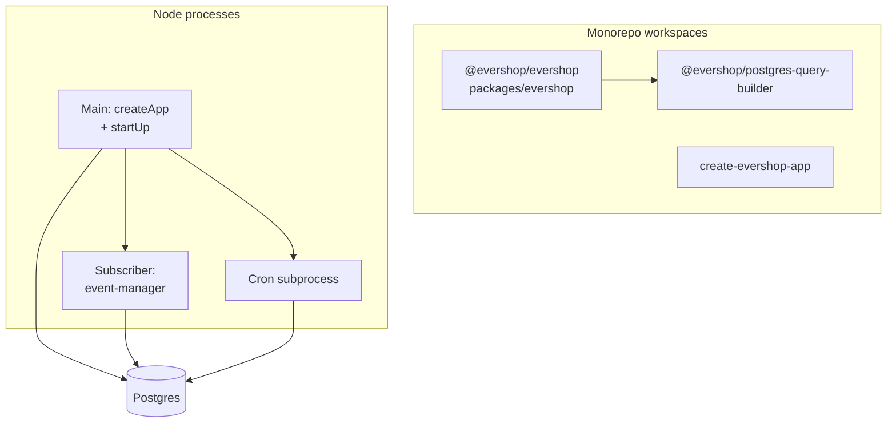
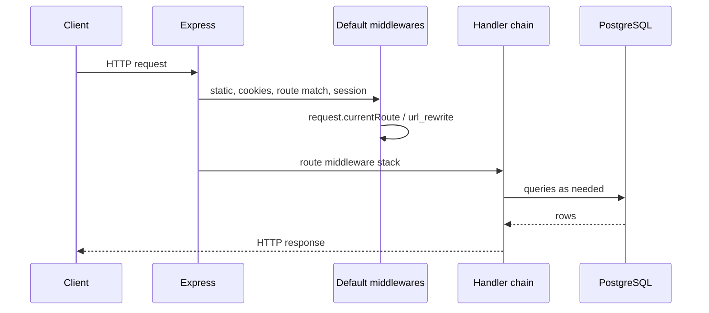
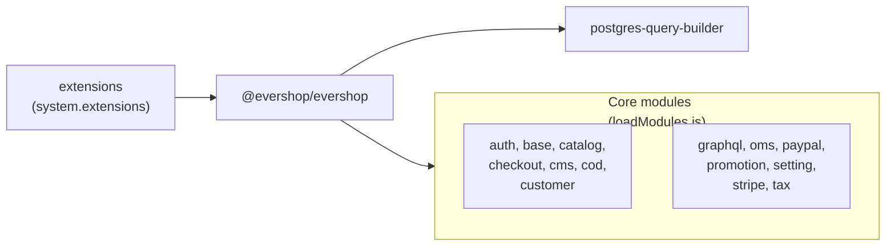

# Architecture (fork)

This file holds **exploration-backed structure**: features, core flows, and diagrams for this checkout. It complements [`AGENTS.md`](../AGENTS.md), which is the shared onboarding guide for the EverShop codebase.

**How to refresh:** in Cursor, run **`/explore-and-document-repo`** and ask the agent to update this file from the live codebase.

**Last updated:** 2026-03-29

---

## Executive summary

EverShop is a **GPL-3.0** e-commerce platform: **Node.js**, **Express**, **PostgreSQL**, **GraphQL**, and **React** (17.x in `packages/evershop`). Install and runtime configuration use the [`config`](https://github.com/node-config/node-config) package (typically `config/default.json` at the project root). When `@evershop/evershop` runs from `node_modules`, important paths resolve from **`process.cwd()`** (see `CONSTANTS` in `packages/evershop/src/lib/helpers.ts`).

**Local work in this monorepo:** install dependencies, run **`pnpm run compile`** and **`pnpm run compile:db`**, configure Postgres and config, run **`pnpm run setup`** once (`evershop install`), then **`pnpm run dev`** or **`pnpm run start`**. Root scripts execute compiled code under `packages/evershop/dist/bin/`.

Upstream product docs: [Getting started](https://evershop.io/docs/development/getting-started/introduction).

**Core module deep dives** (commerce and operations, bootstrap/processors, gaps): [`docs/core-modules/README.md`](./core-modules/README.md).

---

## Repository map

| Path | Role |
|------|------|
| `packages/evershop/` | Platform: CLI (`evershop`), Express app, admin + storefront React, GraphQL, core **modules** under `src/modules/`. Runtime loads **`dist/`** after SWC compile. |
| `packages/postgres-query-builder/` | `@evershop/postgres-query-builder` — PostgreSQL query builder (**MIT**), build output in `dist/`. |
| `packages/create-evershop-app/` | CLI to scaffold new EverShop projects (`create-evershop-app`). |
| `extensions/` | Optional workspace packages; root `package.json` workspaces include `extensions/*`. |

Root `package.json` declares workspaces: `packages/*`, `extensions/*`.

**Where “real” code lives:** `packages/evershop/src/` (compiled to `packages/evershop/dist/`). **Generated / vendor:** `dist/` trees, `node_modules/`, shop-level `.evershop/build`, `media/`, `public/` as applicable.

---

## Runtime & entry points

**CLI binary:** `evershop` → `packages/evershop/dist/bin/evershop.js`. Commands include `build`, `dev`, `start`, `install`, `user:create`, `user:changePassword`, theme commands, and `seed`.

```8:29:packages/evershop/src/bin/evershop.js
  if (command === 'build') {
    await import('./build/index.js');
  } else if (command === 'dev') {
    await import('./dev/index.js');
  } else if (command === 'start') {
    await import('./start/index.js');
  } else if (command === 'install') {
    await import('./install/index.js');
  } else if (command === 'user:create') {
    await import('./user/create.js');
  } else if (command === 'user:changePassword') {
    await import('./user/changePassword.js');
  } else if (command === 'theme:active') {
    await import('./theme/active.js');
  } else if (command === 'theme:twizz') {
    await import('./theme/twizz.js');
  } else if (command === 'theme:create') {
    await import('./theme/create.js');
  } else if (command === 'seed') {
    await import('./seed/index.js');
  } else {
    throw new Error('Invalid command');
  }
```

**Production HTTP process:** `bin/start` loads env, then `start()` from `packages/evershop/src/bin/lib/startUp.js`.

- **`createApp()`** (`packages/evershop/src/bin/lib/app.js`): Express app, loads middleware and routes for each core module and each enabled extension, applies default middleware, registers routes with `Handler.middleware()`.

- **`start()`** (`startUp.js`): `createApp` → bootstrap every module/extension → validate config → **migrations** → listen on port → spawn **event subscriber** child (`event-manager`) and **cron** child.

```26:73:packages/evershop/src/bin/lib/startUp.js
export const start = async function start(context, cb) {
  const app = createApp();
  /** Create a http server */
  const server = http.createServer(app);
  const modules = [...getCoreModules(), ...getEnabledExtensions()];

  /** Loading bootstrap script from modules */
  try {
    for (const module of modules) {
      await loadBootstrapScript(module, context);
    }
    lockHooks();
    lockRegistry();
    // Get the configuration (nodeconfig)
    validateConfiguration(config);
  } catch (e) {
    error(e);
    process.exit(0);
  }
  process.env.ALLOW_CONFIG_MUTATIONS = false;

  /** Migration */
  try {
    await migrate(modules);
  } catch (e) {
    error(e);
    process.exit(0);
  }

  /**
   * Get port from environment and store in Express.
   */
  const port = normalizePort();
  app.set('port', port);

  /** Start listening */
  server.on('listening', () => {
    onListening();
    if (cb) {
      cb();
    }
  });
  server.on('error', onError);
  server.listen(port);

  // Spawn the child process to manage events
  let subscriberChild = startSubscriberProcess(context);
  let jobChild = startCronProcess(context);
```

**Config:** `getConfig()` wraps `node-config` (`packages/evershop/src/lib/util/getConfig.ts`). Extensions are listed under **`system.extensions`**.

**Important env behavior:**
- **`ALLOW_CONFIG_MUTATIONS`:** `true` during dev child spawn, start init, and tests; cleared after bootstrap in the main HTTP process (`startUp.js`).
- **`NODE_ENV`:** production set for `bin/start` via `initEnvStart.ts`; dev uses a separate flow.

---

## Core modules / domains

The core module list is **explicit** in `getCoreModules()`:

```8:78:packages/evershop/src/bin/lib/loadModules.js
const coreModules = [
  {
    name: 'auth',
    resolve: path.resolve(__dirname, '../../modules/auth'),
    path: path.resolve(__dirname, '../../modules/auth')
  },
  {
    name: 'base',
    resolve: path.resolve(__dirname, '../../modules/base'),
    path: path.resolve(__dirname, '../../modules/base')
  },
  {
    name: 'catalog',
    resolve: path.resolve(__dirname, '../../modules/catalog'),
    path: path.resolve(__dirname, '../../modules/catalog')
  },
  {
    name: 'checkout',
    resolve: path.resolve(__dirname, '../../modules/checkout'),
    path: path.resolve(__dirname, '../../modules/checkout')
  },
  {
    name: 'cms',
    resolve: path.resolve(__dirname, '../../modules/cms'),
    path: path.resolve(__dirname, '../../modules/cms')
  },
  {
    name: 'cod',
    resolve: path.resolve(__dirname, '../../modules/cod'),
    path: path.resolve(__dirname, '../../modules/cod')
  },
  {
    name: 'customer',
    resolve: path.resolve(__dirname, '../../modules/customer'),
    path: path.resolve(__dirname, '../../modules/customer')
  },
  {
    name: 'graphql',
    resolve: path.resolve(__dirname, '../../modules/graphql'),
    path: path.resolve(__dirname, '../../modules/graphql')
  },
  {
    name: 'oms',
    resolve: path.resolve(__dirname, '../../modules/oms'),
    path: path.resolve(__dirname, '../../modules/oms')
  },
  {
    name: 'paypal',
    resolve: path.resolve(__dirname, '../../modules/paypal'),
    path: path.resolve(__dirname, '../../modules/paypal')
  },
  {
    name: 'promotion',
    resolve: path.resolve(__dirname, '../../modules/promotion'),
    path: path.resolve(__dirname, '../../modules/promotion')
  },
  {
    name: 'setting',
    resolve: path.resolve(__dirname, '../../modules/setting'),
    path: path.resolve(__dirname, '../../modules/setting')
  },
  {
    name: 'stripe',
    resolve: path.resolve(__dirname, '../../modules/stripe'),
    path: path.resolve(__dirname, '../../modules/stripe')
  },
  {
    name: 'tax',
    resolve: path.resolve(__dirname, '../../modules/tax'),
    path: path.resolve(__dirname, '../../modules/tax')
  }
];
```

| Module | Purpose (summary) | How it plugs in |
|--------|-------------------|-----------------|
| **auth** | Sessions, cookies, admin vs storefront auth | Middleware, services, migrations |
| **base** | Shared infrastructure | Migrations (e.g. event-related base) |
| **catalog** | Products, categories, attributes | Pages, APIs, GraphQL, migrations |
| **checkout** | Cart and checkout | Pages, APIs, migrations |
| **cms** | Pages, widgets, SEO/meta | Pages, APIs, GraphQL, `url_rewrite` usage |
| **cod** | Cash on delivery | Config-driven payment path |
| **customer** | Accounts, addresses | APIs, GraphQL |
| **graphql** | Schema and HTTP endpoints | `/graphql`, `/admin/graphql`, services |
| **oms** | Order management | Admin/storefront surfaces, migrations |
| **paypal** | PayPal checkout APIs + return/cancel pages | `api/`, `pages/frontStore/` |
| **promotion** | Coupons / promotions | APIs |
| **setting** | Shop settings | Services, admin |
| **stripe** | Stripe + webhook | API e.g. `/stripe/webhook` |
| **tax** | Tax configuration | Services, migrations |

**Per-module layout** (typical): `bootstrap.js`, `pages/admin/`, `pages/frontStore/`, `api/`, `graphql/types/`, `migration/`, `services/`, `subscribers/<event>/` (handlers loaded as `.js` from compiled trees).

**Route discovery:** `loadModuleRoutes` scans `pages/admin`, `pages/frontStore`, and `api` (`packages/evershop/src/lib/router/loadModuleRoutes.js`).

**Extensions:** `packages/evershop/src/bin/extension/index.ts` reads `system.extensions`; names must be unique vs core and each other; sorted by **`priority`**; production / `node_modules` paths require **`dist/`**; local dev expects **`src/`** with loading from **`dist`**.

---

## Data & persistence

- **PostgreSQL** via `pg` (`packages/evershop/src/lib/postgres/connection.js`) and **`@evershop/postgres-query-builder`** for query building.
- **Migrations:** versioned files under each module’s `migration/`; run from `migrate(modules)` during startup (`startUp.js`).
- **Event queue:** `emit()` inserts rows into **`event`**; a dedicated process runs `EventStorage` + `EventProcessor`, uses **`LISTEN new_event`** and a polling fallback (`packages/evershop/src/lib/event/event-manager.ts`).
- **Sessions:** `express-session` with **`connect-pg-simple`** when not in test (`packages/evershop/src/bin/lib/addDefaultMiddlewareFuncs.ts`).
- **URL rewrites:** `url_rewrite` table consulted when no direct route match (`addDefaultMiddlewareFuncs.ts`).

**Entities (high level):** product catalog, cart/checkout, orders (OMS), customers, CMS pages/widgets, promotions, settings — exact columns and relations live in migrations and GraphQL types per module.

---

## Public surfaces

| Surface | Representative paths / files |
|---------|------------------------------|
| **Storefront UI** | `modules/*/pages/frontStore/**` + `route.json` |
| **Admin UI** | `modules/*/pages/admin/**`; dev webpack targets `/backend/` (`addDefaultMiddlewareFuncs.ts`) |
| **Storefront GraphQL** | `modules/graphql/api/graphql/route.json` → `/graphql` |
| **Admin GraphQL** | `modules/graphql/api/adminGraphql/route.json` → `/admin/graphql` |
| **REST APIs** | `modules/*/api/**/route.json` (stateless: no session on `isApi` routes) |
| **Webhooks** | e.g. `modules/stripe/api/stripeWebHook` → `/stripe/webhook` |
| **PayPal** | e.g. `/paypal/orders`, `/paypal/captureTransactions`, return/cancel pages under `modules/paypal/pages/frontStore/` |
| **CLI** | `evershop` — see `packages/evershop/src/bin/evershop.js` |

---

## Cross-cutting concerns

| Concern | Notes |
|---------|--------|
| **Auth / session** | Cookie parser; separate admin vs storefront session middleware; **API routes skip session** (`addDefaultMiddlewareFuncs.ts`). |
| **Logging** | `packages/evershop/src/lib/log/logger.js` (Winston); ESLint **`no-console`** applies in many trees — see `eslint.config.js`. |
| **Routing** | Global route table (`lib/router/Router.js`); `request.currentRoute` set by path matching and optional `url_rewrite`. |
| **i18n** | `lib/locale/` (e.g. `translate` on 404 meta). |
| **Build / cache** | `CONSTANTS.CACHEPATH`, `BUILDPATH` in `lib/helpers.ts`; webpack DEV middleware split admin vs storefront. |
| **Events** | Typed registry in `packages/evershop/src/types/event.ts`; `emit` persists then notifies via Postgres. |
| **Background work** | **Event subscriber** process + **cron** process spawned from `startUp.js`. |
| **Hooks / DI-style registries** | `lockHooks()`, `lockRegistry()` after bootstrap. |

---

## How to change things safely

| Step | Command |
|------|---------|
| Install | `pnpm install` |
| Compile platform | `pnpm run compile` |
| Compile query builder | `pnpm run compile:db` |
| Install / migrate (CLI) | `pnpm run setup` → `evershop install` |
| Tests | **`pnpm run compile` first** — Jest only matches `**/dist/**/tests/**/unit/**/*.test.[jt]s` (`jest.config.js`) |
| Lint | `pnpm run lint` (not in default CI) |

**CI** (`.github/workflows/build_test.yml`): Node 20 and 22; `npm install`, `npm run compile`, `npm run compile:db`, `npm run test`.

**Contributing:** target upstream branch **`dev`** per `CONTRIBUTING.md`; include tests for behavior changes.

---

## Diagrams

### System context



### High-level architecture



### Request or job flow



### Module / package dependency



---

## Source-of-truth index

| Topic | Primary references |
|------|---------------------|
| Agent / contributor checklist | [`AGENTS.md`](../AGENTS.md) |
| Core module list | `packages/evershop/src/bin/lib/loadModules.js` |
| App assembly & route registration | `packages/evershop/src/bin/lib/app.js` |
| Startup, migrations, child processes | `packages/evershop/src/bin/lib/startUp.js` |
| Request pipeline (session, routing, rewrites, dev webpack) | `packages/evershop/src/bin/lib/addDefaultMiddlewareFuncs.ts` |
| Extensions | `packages/evershop/src/bin/extension/index.ts` |
| Route loading | `packages/evershop/src/lib/router/loadModuleRoutes.js` |
| Events (emit, storage, processor) | `packages/evershop/src/lib/event/emitter.ts`, `EventStorage.ts`, `EventProcessor.ts`, `event-manager.ts` |
| Path constants | `packages/evershop/src/lib/helpers.ts` |
| Jest | `jest.config.js` (root) |
| CI | `.github/workflows/build_test.yml` |
| Published exports | `packages/evershop/package.json` `exports` |
| Changelog | [`changelog.md`](../changelog.md) |

---

## Known gaps

- **Exhaustive route list:** derive from `**/route.json` across modules; not duplicated here.
- **Port and full validation rules:** `normalizePort()`, `validateConfiguration()` — read those files for exact behavior.
- **create-evershop-app sample layout:** `packages/create-evershop-app/sample/`.
