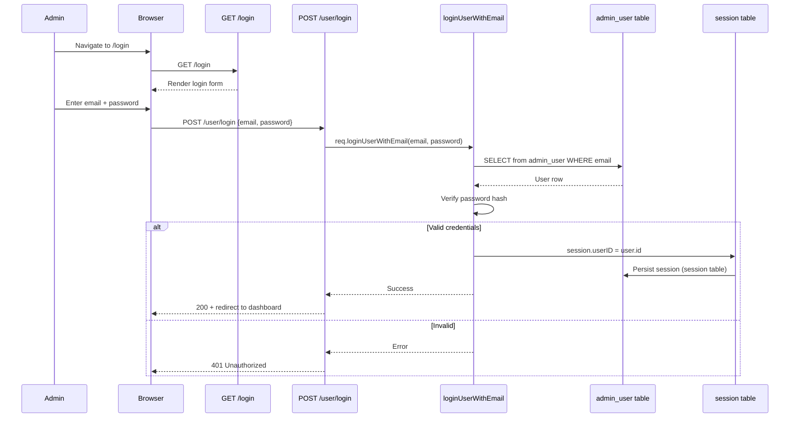
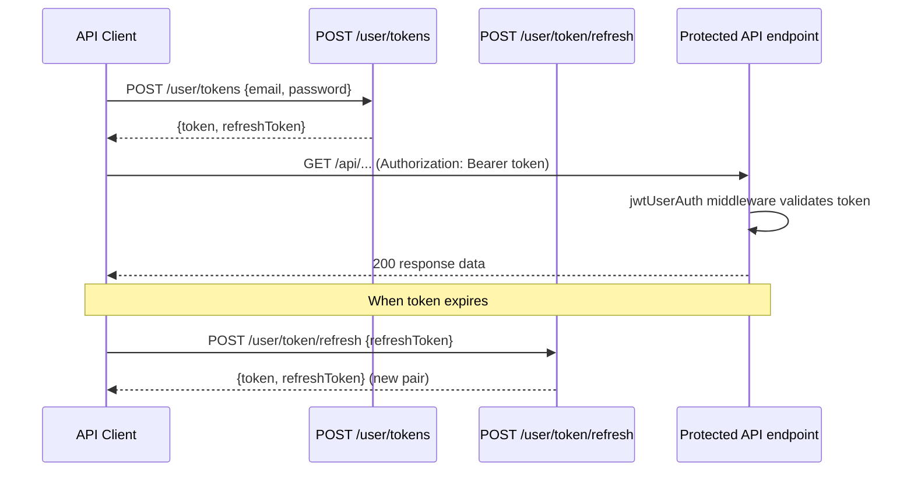

# Module: `auth`

## Purpose

**auth** covers **admin** authentication: session-backed login/logout, exposing helpers on the Express `request` object, JWT-related API middleware for identifying the current user, and **GraphQL admin types** for `AdminUser`.

## How it works

1. **Bootstrap** — `bootstrap.ts` attaches to `express.request`:

   - `loginUserWithEmail(email, password, callback)` — delegates to `loginUserWithEmail` service, then `session.save`.
   - `logoutUser(callback)` — clears session via `logoutUser` service.
   - `isUserLoggedIn()` — `!!session.userID`.
   - `getCurrentUser()` — returns `res.locals.user` (populated by auth middleware).

2. **HTTP** — `api/global/` chains JWT and `getCurrentUser` handlers; token refresh lives under `api/refreshUserToken/` and `api/getUserToken/`. Admin login/logout JSON endpoints sit under `pages/admin/`.

3. **Pages** — Admin shell uses `[context]isAdmin[auth].js` to gate the admin UI.

4. **Persistence** — Migrations maintain admin user tables (see `migration/`).

## Framework implementation

| Mechanism | Location |
|-----------|----------|
| Bootstrap / `request` API | `modules/auth/bootstrap.ts` |
| Login/logout services | `services/loginUserWithEmail.ts`, `logoutUser.ts` |
| Session naming helpers | `getSessionConfig.ts`, `getAdminSessionCookieName.ts`, `getCookieSecret.ts` |
| API | `api/global/[context]jwtUserAuth[getCurrentUser].ts`, `api/getUserToken/*`, `api/refreshUserToken/*` |
| GraphQL | `graphql/types/AdminUser/AdminUser.admin.graphql` + resolvers |

Customer-facing auth is implemented in the **customer** module; `auth` is intentionally **admin-centric**.

## HTTP APIs

| Route | Method | Path | Role |
|-------|--------|------|------|
| `getUserToken` | POST | `/user/tokens` | Issue JWT for admin user |
| `refreshUserToken` | POST | `/user/token/refresh` | Refresh admin JWT |
| `adminLoginJson` | POST | `/user/login` | Admin session login |
| `adminLogoutJson` | GET, POST | `/user/logout` | Admin session logout |
| `adminLogin` | GET | `/login` | Admin login page |

Global middleware in `api/global/`: `[context]jwtUserAuth`, `getCurrentUser`, `demoAccountBlocking`, `auth`.

## Database tables

| Table | Migration | Role |
|-------|-----------|------|
| `admin_user` | `Version-1.0.0` (create) | Admin user credentials and profile |
| `user_token_secret` | `Version-1.0.0` (create), `Version-1.0.1` (dropped) | Deprecated token secret storage |
| `session` | `Version-1.0.1` (create, PK on `sid`, index on `expire`) | Express session store (admin + customer) |

## GraphQL types

| Type | File | Scope | Query fields |
|------|------|-------|-------------|
| `AdminUser`, `AdminUserCollection` | `AdminUser.admin.graphql` | Admin only | `adminUser`, `currentAdminUser`, `adminUsers` |

## User flows

### Admin login (session-based)

### Admin JWT token flow (API clients)

## What could be done better

- **Naming** — The module name `auth` sounds generic; new contributors may assume it covers customers. Renaming to `adminAuth` (breaking) or a prominent note in `AGENTS.md` / this doc reduces confusion.

- **Session vs JWT** — Document the split: where session ends and JWT begins for API clients, and token lifetimes/rotation policy.

- **Type safety** — `EvershopRequest` extensions are scattered; a single referenced interface document or barrel export helps extensions implement compatible middleware.

- **Security hardening** — Rate limiting and account lockout for `loginUserWithEmail` (if not present elsewhere) are typical production asks; worth auditing in one place.
