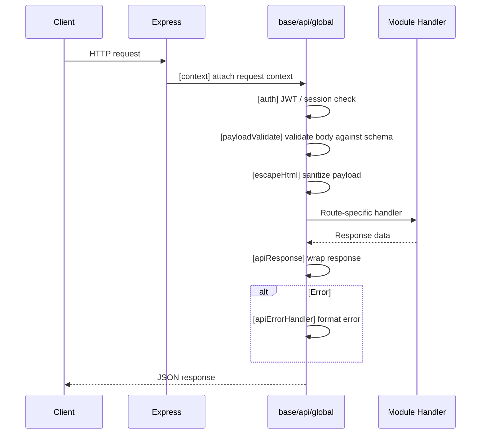
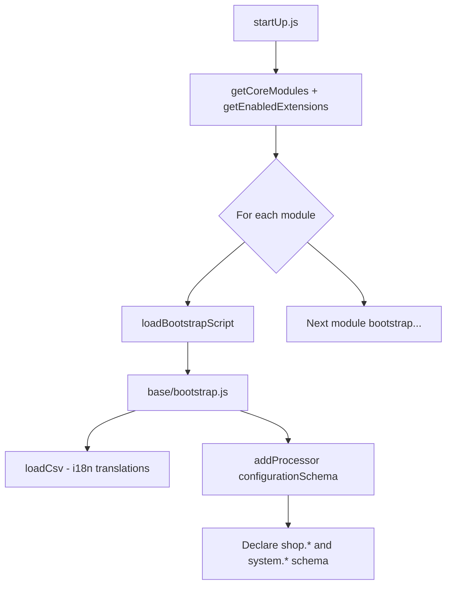

# Module: `base`

## Purpose

The **base** module is the cross-cutting foundation: it loads translation CSVs, extends the **validated configuration schema** for the whole app, and provides **global HTTP API behavior** (context, payload validation, error handling, HTML escaping). It also exposes small **GraphQL scalars and reference data** (country, currency, timezone, version, admin route metadata).

## How it works

1. **Startup** — Core modules run `bootstrap.js` in **`getCoreModules()` order** (`auth`, then `base`, then `catalog`, …); see `packages/evershop/src/bin/lib/startUp.js`. Each module’s bootstrap runs only if `bootstrap.js` exists in that folder (compiled from `.ts` where applicable). `base` calls `loadCsv()` for locale strings and registers a `configurationSchema` processor that declares `shop.*` and `system.*` shape (home URL, currency, language, timezone, weight unit, `system.extensions`, `system.theme`, `system.session`).

2. **Every API request** — Under `api/global/`, middleware chains attach: context, JWT/admin auth hooks, payload validation, API response wrappers, and HTML escape rules for selected payloads. Admin and storefront page trees also pull in `[context]` and error handlers from `pages/global/`.

3. **GraphQL** — Shared types like `Country`, `Currency`, `DateTime`, `Province`, `Timezone`, `Url`, and admin-only `Route` support lists used in settings and forms.

## Framework implementation

| Mechanism              | Location / pattern                                                                    |
| ---------------------- | ------------------------------------------------------------------------------------- |
| Bootstrap              | `modules/base/bootstrap.js` — `addProcessor('configurationSchema', ...)`, `loadCsv()` |
| Registry processors    | `lib/util/registry.js` (`addProcessor`)                                               |
| Global API middleware  | `modules/base/api/global/*.ts` and `*.js`                                             |
| Global page middleware | `modules/base/pages/global/*`                                                         |
| Services               | `getAjv.js`, `escapePayload.ts`, `notifications.js`, `secret.js`, `markSkipEscape.ts` |
| Migrations             | `migration/Version-*.js`                                                              |

Other modules merge additional keys into the same `configurationSchema` processor chain; `config` (node-config) is validated against the merged schema.

## HTTP APIs

No dedicated `route.json` endpoints. `base` contributes only **global middleware** (applied to every API/page request):

| Middleware                     | Chain position | Role                                   |
| ------------------------------ | -------------- | -------------------------------------- |
| `[context]`                    | API + pages    | Attaches request context               |
| `[auth]payloadValidate`        | API            | JSON Schema validation of request body |
| `[payloadValidate]escapeHtml`  | API            | HTML-escape payloads to prevent XSS    |
| `[apiResponse]apiErrorHandler` | API            | Structured error responses             |
| `[auth]notFound[response]`     | Pages          | 404 handler                            |
| `[response]errorHandler`       | Pages          | Global page error handler              |

## Database tables

| Table   | Migration                                                                    | Role                                      |
| ------- | ---------------------------------------------------------------------------- | ----------------------------------------- |
| `event` | `Version-1.0.1` (create), `Version-1.0.2` (alter + index `EVENT_STATUS_IDX`) | Event queue for async subscriber pipeline |

Other modules (customer, catalog, checkout) insert into `event` via triggers but do not own it.

## GraphQL types

| Type                      | File                  | Scope      | Query fields                    |
| ------------------------- | --------------------- | ---------- | ------------------------------- |
| `Country`                 | `Country.graphql`     | Shared     | `countries`, `allowedCountries` |
| `Currency`                | `Currency.graphql`    | Shared     | `currencies`                    |
| `DateTime`                | `DateTime.graphql`    | Shared     | *(scalar/type only)*            |
| `Province`                | `Province.graphql`    | Shared     | `provinces`                     |
| `Timezone`                | `Timezone.graphql`    | Shared     | `timezones`                     |
| `Url` (+input `UrlParam`) | `Url.graphql`         | Shared     | `url`, `version`                |
| `Route`                   | `Route.admin.graphql` | Admin only | `routes`                        |

## User flows

### Request lifecycle (every HTTP request)

### App startup (bootstrap)

## What could be done better

- **Ordering guarantees** — If `loadCsv()` must complete before any other module serves i18n, document or enforce ordering explicitly in bootstrap (today it depends on module iteration order).

- **Schema ownership** — `shop` / `system` fragments live in `base`, while `catalog`, `checkout`, `oms`, etc. add siblings. A single diagram or generated JSON Schema export would help operators see the full merged shape.

- **Global middleware discoverability** — The bracket naming convention (`[auth]payloadValidate`) is powerful but easy to miss; a short developer doc table listing the global stack and file order would reduce onboarding cost.

- **Tests** — Global API middleware is security-sensitive (escape, JWT); targeted integration tests per middleware file would catch regressions early.
