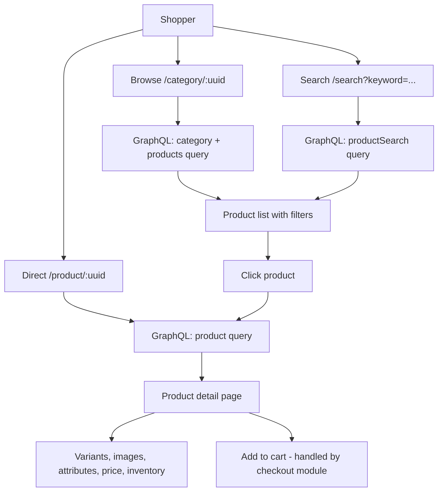
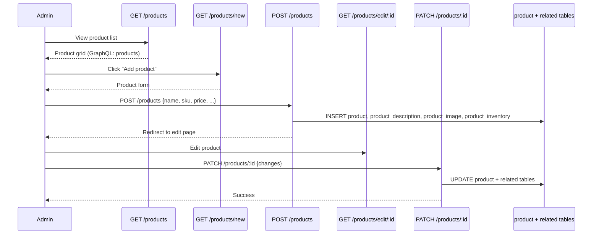
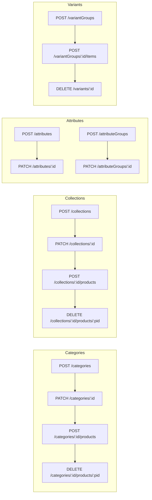

# Module: `catalog`

## Purpose

**catalog** is the **product domain**: products, variants, categories, collections, attributes, attribute groups, images, and storefront/admin UIs for browsing and managing them. It defines **`catalog.*` and `pricing.*` defaults** (image dimensions, out-of-stock visibility, collection page size, rounding mode and precision), registers **collection filter processors** for GraphQL/admin lists, enriches **cart line items** with product URL and variant option fields, and registers a **CMS widget** (`collection_products`) for embedding collection-based product grids on pages.

## How it works

1. **Configuration** — On bootstrap, the module merges JSON Schema fragments into `configurationSchema` and calls `config.util.setModuleDefaults` for `catalog` and `pricing` so installs get sensible defaults without a full `config` file.

2. **Cart item presentation** — Processors `registerCartItemProductUrlField` and `registerCartItemVariantOptionsField` add derived data cart lines need at checkout and in the mini-cart.

3. **Filter registry** — `productCollectionFilters`, `categoryCollectionFilters`, `collectionCollectionFilters`, `attributeCollectionFilters`, and `attributeGroupCollectionFilters` each get a default filter registrar plus shared pagination filters (same pattern as customer/oms).

4. **Widgets** — `registerWidget` connects admin “widget settings” UI to a storefront React component for collection-driven product lists.

5. **GraphQL + HTTP + pages** — Large surface: types for products, variants, collections, categories, etc.; many admin and storefront routes under `pages/` and `api/`.

6. **Migrations** — Schema for catalog tables lives under `migration/`.

## Framework implementation

| Mechanism | Location |
|-----------|----------|
| Bootstrap | `modules/catalog/bootstrap.js` |
| Cart item fields | `services/registerCartItemProductUrlField.js`, `registerCartItemVariantOptionsField.js` |
| Collection filters | `registerDefault*CollectionFilters.js` |
| Widgets | `registerWidget` in bootstrap + `components/CollectionProducts*.js` |
| Pricing/tax interaction | `pricing` keys here; **tax** module extends `pricing.tax` |

Dependencies: **checkout** imports `getProductsBaseQuery` for the cart item product loader; **promotion** and **tax** hang additional processors on `cartItemFields` / `cartFields`.

## HTTP APIs

### Product

| Route | Method | Path |
|-------|--------|------|
| `createProduct` | POST | `/products` |
| `updateProduct` | PATCH | `/products/:id` |
| `deleteProduct` | DELETE | `/products/:id` |
| `productGrid` | GET | `/products` |
| `productEdit` | GET | `/products/edit/:id` |
| `productNew` | GET | `/products/new` |
| `productView` | GET | `/product/:uuid` (storefront) |

### Category

| Route | Method | Path |
|-------|--------|------|
| `createCategory` | POST | `/categories` |
| `updateCategory` | PATCH | `/categories/:id` |
| `deleteCategory` | DELETE | `/categories/:id` |
| `addProductToCategory` | POST | `/categories/:category_id/products` |
| `removeProductFromCategory` | DELETE | `/categories/:category_id/products/:product_id` |
| `categoryView` | GET | `/category/:uuid` (storefront) |

### Collection

| Route | Method | Path |
|-------|--------|------|
| `createCollection` | POST | `/collections` |
| `updateCollection` | PATCH | `/collections/:id` |
| `deleteCollection` | DELETE | `/collections/:id` |
| `addProductToCollection` | POST | `/collections/:collection_id/products` |
| `removeProductFromCollection` | DELETE | `/collections/:collection_id/products/:product_id` |

### Attribute & variant

| Route | Method | Path |
|-------|--------|------|
| `createAttribute` | POST | `/attributes` |
| `updateAttribute` | PATCH | `/attributes/:id` |
| `deleteAttribute` | DELETE | `/attributes/:id` |
| `createAttributeGroup` | POST | `/attributeGroups` |
| `updateAttributeGroup` | PATCH | `/attributeGroups/:id` |
| `deleteAttributeGroup` | DELETE | `/attributeGroups/:id` |
| `createVariantGroup` | POST | `/variantGroups` |
| `addVariantItem` | POST | `/variantGroups/:id/items` |
| `unlinkVariant` | DELETE | `/variants/:id` |
| `variantSearch` | GET | `/variants` |
| `catalogSearch` | GET | `/search` (storefront) |

## Database tables

| Table | Migration | Role |
|-------|-----------|------|
| `attribute` | `Version-1.0.0` | Attribute definitions |
| `attribute_option` | `Version-1.0.0` | Attribute select/multiselect options |
| `attribute_group` | `Version-1.0.0` | Groups of attributes |
| `attribute_group_link` | `Version-1.0.0` | M:N attribute ↔ group |
| `variant_group` | `Version-1.0.0` | Variant group container |
| `product` | `Version-1.0.0` (create), multiple alters through `1.0.8` | Core product row |
| `product_description` | `Version-1.0.0`, GIN index `PRODUCT_SEARCH_INDEX` in `1.0.5` | Translatable product text + full-text search |
| `product_attribute_value_index` | `Version-1.0.0`, alter `1.0.1` | Flattened attribute values for filtering |
| `product_custom_option` | `Version-1.0.0` | Custom options (engravings, etc.) |
| `product_custom_option_value` | `Version-1.0.0` | Option value choices |
| `product_image` | `Version-1.0.0`, alter `1.0.6` | Product images |
| `product_inventory` | `Version-1.0.2` (create), trigger `1.0.4` | Stock qty and availability |
| `category` | `Version-1.0.0`, alter `1.0.7` | Category tree |
| `category_description` | `Version-1.0.0` | Category SEO/text |
| `product_category` | `Version-1.0.0` (create), dropped `1.0.2` | Legacy M:N (replaced by FK on product) |
| `collection` | `Version-1.0.0` | Curated product collections |
| `product_collection` | `Version-1.0.0` | M:N product ↔ collection |
| `url_rewrite` | `Version-1.0.2` | SEO-friendly URL mappings |

## GraphQL types

| Type | File | Scope | Query fields |
|------|------|-------|-------------|
| `Product`, `ProductCollection`, `ProductSearch` | `Product.graphql` / `.admin` | Shared + Admin | `product`, `currentProduct`, `products`, `productSearch` |
| `Variant`, `VariantGroup` | `Variant.graphql` | Shared | *(extends Product)* |
| `ProductPrice`, `PriceRange` | `ProductPrice.graphql` | Shared | *(extends Product)* |
| `Inventory` | `Inventory.graphql` / `.admin` | Shared + Admin | *(extends Product)* |
| `Image` | `ProductImage.graphql` | Shared | *(extends Product)* |
| `CustomOption`, `OptionValue` | `CustomOption.graphql` | Shared | *(extends Product)* |
| `ProductAttributeIndex` | `ProductAttribute.graphql` | Shared | *(extends Product)* |
| `Category`, `CategoryCollection` | `Category.graphql` / `.admin` | Shared + Admin | `category`, `currentCategory`, `categories` |
| `Collection`, `CollectionCollection` | `Collection.graphql` / `.admin` | Shared + Admin | `collection`, `collections` |
| `Attribute`, `AttributeCollection` | `Attribute.graphql` / `.admin` | Shared + Admin | `attribute`, `attributes` |
| `AttributeGroup`, `AttributeGroupCollection` | `Attribute.admin.graphql` | Admin | `attributeGroups` |
| `FeaturedProduct` | `FeaturedProduct.graphql` | Shared | `featuredProducts` |
| `CollectionProductsWidget` | `CollectionProductsWidget.graphql` | Shared | `collectionProductsWidget` |

## User flows

### Storefront product browsing

### Admin product management

### Admin category / collection / attribute lifecycle

## What could be done better

- **Module size** — `catalog` is a natural candidate for sub-packages or documented sub-areas (media, search, URL) to navigate the tree.

- **Search** — If full-text or faceted search grows, isolating query builders and index updates avoids sprawl across GraphQL resolvers.

- **Inventory** — `showOutOfStockProduct` is config-level; reserving stock at checkout and concurrent stock decrements are cross-cutting (involves **checkout**/**oms**); a short ADR on stock semantics would help.

- **Widget registration** — Path-based `component` resolution works but is brittle for extensions; exporting widget manifests from a single registry file could simplify testing.
