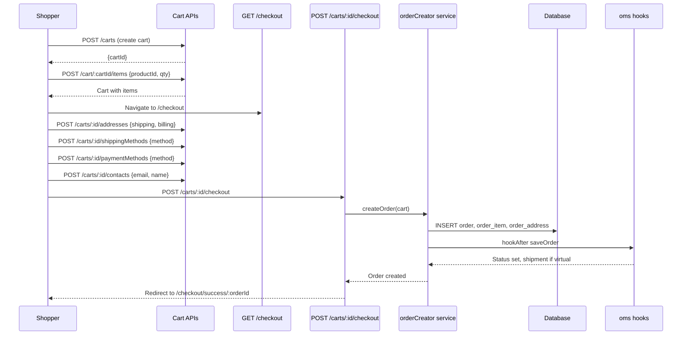
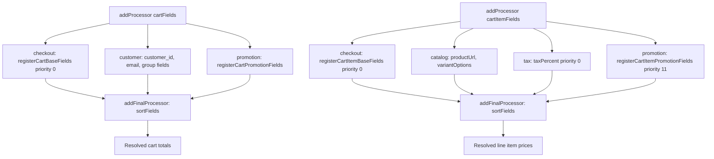

# Module: `checkout`

## Purpose

**checkout** owns the **shopping cart model**, **field resolvers** for cart and line items, **product loading** for lines, **payment method registration** (used by Stripe, PayPal, COD), and **order creation/saving** orchestration. It merges `checkout.*` configuration (e.g. shipping note visibility) and ties the cart to catalog queries.

## How it works

1. **Cart field pipeline** — `addProcessor('cartFields', registerCartBaseFields, 0)` and `addFinalProcessor('cartFields', sortFields)` establish a priority-ordered list of field definitions. **Customer**, **promotion**, **tax**, and other modules append processors at their own priorities; a final sort stabilizes order.

2. **Line items** — Same pattern with `cartItemFields` and `registerCartItemBaseFields`.

3. **Product loader** — `cartItemProductLoaderFunction` processor returns an async loader using `getProductsBaseQuery()` from **catalog** so line items hydrate product rows efficiently.

4. **Payment methods** — `registerPaymentMethod` (in `services/getAvailablePaymentMethods.ts`) pushes factories into the `checkoutPaymentMethods` processor list. `getAvailablePaymentMethods()` validates each factory, runs `init()` for `code`/`name`, and filters by `validator()` (e.g. enabled in settings).

5. **Orders** — Services like `orderCreator.js` coordinate persistence; **oms** hooks `saveOrder`, `changePaymentStatus`, and `changeShipmentStatus` to manage lifecycle beyond “placed”.

6. **GraphQL + API + pages** — Cart mutations/queries, checkout steps, shipping endpoints, etc., spread across this module.

## Framework implementation

| Mechanism | Location |
|-----------|----------|
| Bootstrap | `modules/checkout/bootstrap.ts` |
| Payment registry | `services/getAvailablePaymentMethods.ts` — `registerPaymentMethod`, `getAvailablePaymentMethods` |
| Cart fields | `services/cart/registerCartBaseFields.js`, `sortFields.js`, `registerCartItemBaseFields.js` |
| Order creation | `services/orderCreator.js` (and related) |
| Config | `configurationSchema` fragment `checkout.showShippingNote` |

The inline **TODO** in `getAvailablePaymentMethods` acknowledges future per-cart / per-zone method lists.

## HTTP APIs

### Cart

| Route | Method | Path |
|-------|--------|------|
| `createCart` | POST | `/carts` |
| `addCartItem` | POST | `/cart/:cart_id/items` |
| `addMineCartItem` | POST | `/cart/mine/items` |
| `updateCartItemQty` | PATCH | `/cart/:cart_id/items/:item_id` |
| `updateMineCartItemQty` | PATCH | `/cart/mine/items/:item_id` |
| `removeCartItem` | DELETE | `/cart/:cart_id/items/:item_id` |
| `removeMineCartItem` | DELETE | `/cart/mine/items/:item_id` |
| `addCartAddress` | POST | `/carts/:cart_id/addresses` |
| `addCartContactInfo` | POST | `/carts/:cart_id/contacts` |
| `addCartPaymentMethod` | POST | `/carts/:cart_id/paymentMethods` |
| `addCartShippingMethod` | POST | `/carts/:cart_id/shippingMethods` |
| `addShippingNote` | POST | `/carts/:cart_id/shippingNotes` |

### Checkout & orders

| Route | Method | Path |
|-------|--------|------|
| `cartCheckout` | POST | `/carts/:cart_id/checkout` |
| `createOrder` | POST | `/orders` |
| `cart` | GET | `/cart` (storefront page) |
| `checkout` | GET | `/checkout` (storefront page) |
| `checkoutSuccess` | GET | `/checkout/success/:orderId?` |

### Shipping (admin)

| Route | Method | Path |
|-------|--------|------|
| `createShippingMethod` | POST | `/shippingMethods` |
| `updateShippingMethod` | PATCH | `/shippingMethods/:id` |
| `createShippingZone` | POST | `/shippingZones` |
| `updateShippingZone` | PATCH | `/shippingZones/:id` |
| `deleteShippingZone` | DELETE | `/shippingZones/:id` |
| `addShippingZoneMethod` | POST | `/shippingZones/:id/methods` |
| `updateShippingZoneMethod` | PATCH | `/shippingZones/:zone_id/methods/:method_id` |
| `deleteShippingZoneMethod` | DELETE | `/shippingZones/:zone_id/methods/:method_id` |
| `shippingSetting` | GET | `/setting/shipping` (admin page) |

## Database tables

| Table | Migration | Role |
|-------|-----------|------|
| `cart` | `Version-1.0.0` (create), many alters through `1.0.7` | Shopping cart header (totals, tax, shipping, customer ref) |
| `cart_address` | `Version-1.0.0` | Shipping/billing addresses on cart |
| `cart_item` | `Version-1.0.0`, alters through `1.0.7` | Line items (qty, price, tax, discount) |
| `order` | `Version-1.0.0` (create), alters through `1.0.6` | Placed order header |
| `order_address` | `Version-1.0.0` | Snapshot of addresses at order time |
| `order_item` | `Version-1.0.0`, alters through `1.0.6` | Order line items |
| `order_activity` | `Version-1.0.0` | Audit log of order events |
| `payment_transaction` | `Version-1.0.0` | Payment gateway transaction records |
| `shipment` | `Version-1.0.0` | Shipment records per order |
| `shipping_zone` | `Version-1.0.1` | Geographic shipping zones |
| `shipping_zone_province` | `Version-1.0.1` | Province-level zone matching |
| `shipping_method` | `Version-1.0.1` | Shipping method definitions |
| `shipping_zone_method` | `Version-1.0.1`, alter `1.0.5` | M:N zone ↔ method with rate rules |

## GraphQL types

| Type | File | Scope | Query fields |
|------|------|-------|-------------|
| `Cart`, `CartAddress`, `CartItem`, `VariantOption` | `Cart.graphql` | Shared | `cart`, `myCart` |
| `Price` | `Price.graphql` | Shared | *(scalar)* |
| `Weight` | `Weight.graphql` | Shared | *(scalar)* |
| `Date` | `Date.graphql` | Shared | *(scalar)* |
| `AvailableShippingMethod` | `AvailableShippingMethod.graphql` | Shared | *(extends Cart)* |
| `AvailablePaymentMethod` | `AvailablePaymentMethod.graphql` | Shared | *(extends Cart)* |
| `ShippingZone`, `ShippingMethod`, `ShippingMethodByZone` | `ShippingZone.graphql` / `ShippingMethod.admin.graphql` | Shared + Admin | `shippingZones`, `shippingZone`, `shippingMethods` |
| `CheckoutSetting` | `CheckoutSetting.graphql` | Shared | *(extends Setting)* |

## User flows

### Full checkout flow (storefront)

### Cart field pipeline (internal)

### Shipping method configuration (admin)

## What could be done better

- **Per-cart payment methods** — Implementing the TODO would support B2B, geo-restricted methods, or high-risk baskets without forking core.

- **Cart field debugging** — When many modules add fields, a dev-only introspection endpoint listing processors and priorities would speed up “why is this total wrong?” investigations.

- **Order/cart transaction boundary** — Document SQL transaction scope (connection threading through `hookAfter` in oms) for extension authors doing inventory holds.

- **Idempotency** — Place-order APIs benefit from idempotency keys for double-submit and mobile retries; worth a first-class pattern.
