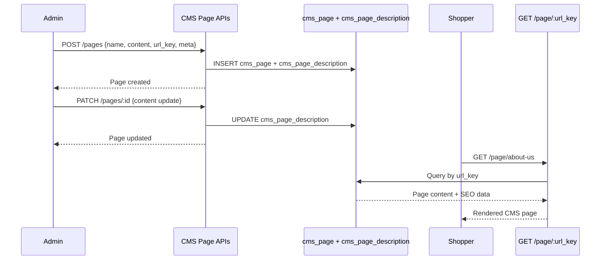
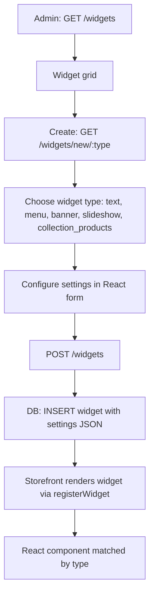
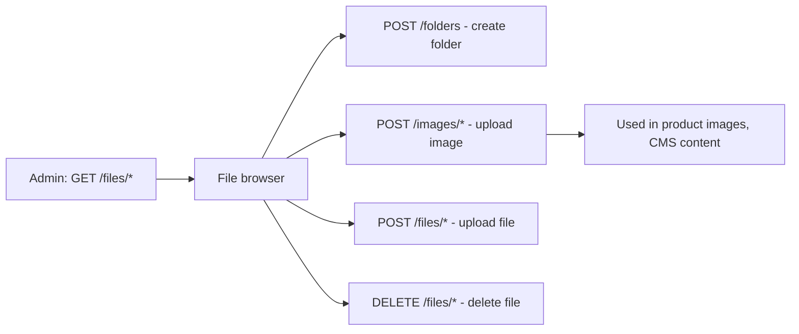

# Module: `cms`

## Purpose

**cms** provides **pages**, **widgets**, and **theme-facing configuration** (`themeConfig`): logo, head tags, menus, and related JSON-schema fragments merged into `configurationSchema`. It registers **collection filters** for page and widget admin lists and wires **widget types** to React components for the storefront.

## How it works

1. **Schema extension** — Bootstrap merges `themeConfig` (logo, `headTags` links/metas/scripts, etc.) so validated config drives the theme layer.

2. **Widgets** — Similar to **catalog**, `registerWidget` connects admin settings components to storefront renderers (type, default settings, enabled flag).

3. **Routing** — CMS pages participate in the route system (`Route` types referenced in bootstrap); storefront resolves CMS pages alongside catalog routes.

4. **Collections** — `pageCollectionFilters`, `widgetCollectionFilters` with default registrars + pagination.

5. **GraphQL + pages + migrations** — Admin page builder/grid, storefront page view, widget instances stored in Postgres.

## Framework implementation

| Mechanism | Location |
|-----------|----------|
| Bootstrap | `modules/cms/bootstrap.ts` |
| Filters | `services/registerDefaultPageCollectionFilters.js`, `registerDefaultWidgetCollectionFilters.js` |
| Widgets | `registerWidget` calls in bootstrap |
| Types | `types/route.js` usage for route registration patterns |

**base** exposes admin `Route` GraphQL types; **cms** consumes route/page concepts for content.

## HTTP APIs

### CMS pages

| Route | Method | Path | Role |
|-------|--------|------|------|
| `createCmsPage` | POST | `/pages` | Create page |
| `updateCmsPage` | PATCH | `/pages/:id` | Edit page |
| `deleteCmsPage` | DELETE | `/pages/:id` | Remove page |
| `cmsPageNew` | GET | `/pages/new` | Admin page |
| `cmsPageGrid` | GET | `/pages` | Admin page |
| `cmsPageEdit` | GET | `/pages/edit/:id` | Admin page |
| `cmsPageView` | GET | `/page/:url_key` | Storefront page |

### Widgets

| Route | Method | Path | Role |
|-------|--------|------|------|
| `createWidget` | POST | `/widgets` | Create widget |
| `updateWidget` | PATCH | `/widgets/:id` | Edit widget |
| `deleteWidget` | DELETE | `/widgets/:id` | Remove widget |
| `widgetNew` | GET | `/widgets/new/:type` | Admin page |
| `widgetGrid` | GET | `/widgets` | Admin page |
| `widgetEdit` | GET | `/widgets/edit/:id` | Admin page |

### Media / files

| Route | Method | Path | Role |
|-------|--------|------|------|
| `imageUpload` | POST | `/images/*` | Upload image |
| `fileUpload` | POST | `/files/*` | Upload file |
| `fileDelete` | DELETE | `/files/*` | Delete file |
| `fileBrowser` | GET | `/files/*` | Browse files |
| `folderCreate` | POST | `/folders` | Create folder |

### Other

| Route | Method | Path |
|-------|--------|------|
| `homepage` | GET | `/` (storefront) |
| `dashboard` | GET | `/` (admin) |
| `staticAsset` / `adminStaticAsset` | GET | `/assets/*` |
| `notFound` / `adminNotFound` | GET | `/notfound` |
| `images` | GET | `/images` |

## Database tables

| Table | Migration | Role |
|-------|-----------|------|
| `cms_page` | `Version-1.0.0` (create), `Version-1.1.1` (drop `layout`) | CMS page content |
| `cms_page_description` | `Version-1.0.0` | SEO/text for pages |
| `widget` | `Version-1.1.0` | Widget instances and settings |

## GraphQL types

| Type | File | Scope | Query fields |
|------|------|-------|-------------|
| `CmsPage`, `CmsPageCollection` | `CmsPage.graphql` | Shared | `cmsPage`, `currentCmsPage`, `cmsPages` |
| `Widget`, `WidgetType`, `WidgetCollection` + widget subtypes | `Widget.graphql` | Shared | `widget`, `widgets`, `widgetTypes`, `widgetType` |
| `ThemeConfig`, `Logo`, `HeadTag`, `Link`, `Meta`, `Script`, `Base` | `ThemeConfig.graphql` | Shared | `themeConfig` |
| `PageInfo`, `Breadcrumb`, `OgInfo` | `PageInfo.graphql` | Shared | `pageInfo` |
| `Menu`, `MenuItem` | `Menu.graphql` | Shared | `menu` |

## User flows

### CMS page lifecycle (admin + storefront)

### Widget management

### Media / file management

## What could be done better

- **Widget versioning** — Renaming or migrating `defaultSettings` for widgets can break existing pages; add migration helpers or version fields.

- **Draft/preview** — Enterprise CMS expectations include draft content and preview URLs; if not present, call that gap out in product positioning.

- **SEO** — `headTags` in config is good; per-page meta overrides and sitemap generation are common next steps.

- **Performance** — Page + widget graphs can over-fetch; DataLoader patterns in GraphQL resolvers (already used elsewhere) should be consistent here.

- **Access control** — Admin page editing permissions (roles) may need documenting if **auth** evolves beyond binary admin login.
