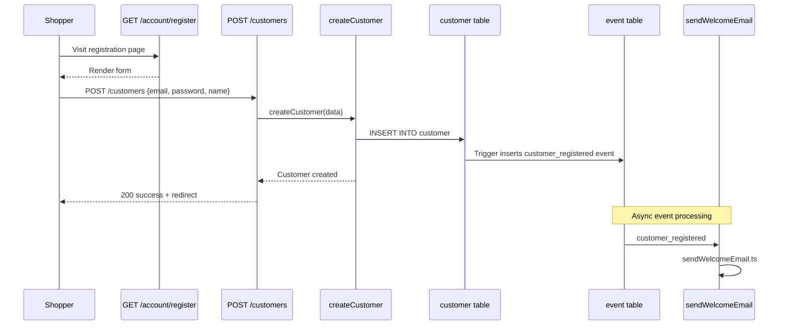
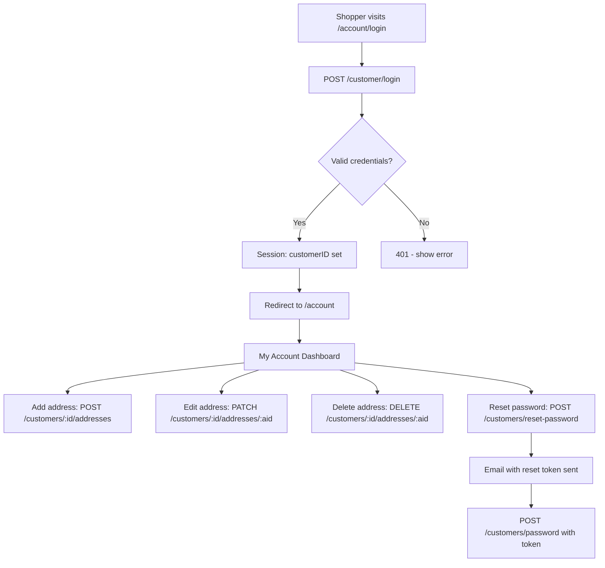
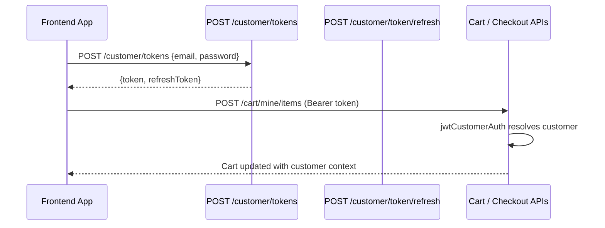

# Module: `customer`

## Purpose

**customer** implements **storefront customer accounts**: registration, login/logout, profile and address CRUD, password reset, JWT/session bridging for APIs, **customer groups**, admin customer grid/edit, and a **welcome email** subscriber.

It also **extends the cart model** so `customer_id`, `customer_group_id`, `customer_email`, and `customer_full_name` participate in cart field resolvers (important for pricing and promotions).

## How it works

1. **Bootstrap** — Registers:

   - `cartFields` processors — copy-through resolvers for the four customer-related cart keys (triggered vs stored value pattern used across cart fields).
   - `request` helpers: `loginCustomerWithEmail`, `logoutCustomer` (via `hookable` wrapper), `isCustomerLoggedIn`, `getCurrentCustomer`.
   - `customerCollectionFilters` / `customerGroupCollectionFilters` — default filters plus pagination filters.

2. **HTTP APIs** — REST-style handlers under `api/createCustomer`, `updateCustomer`, addresses, `resetPassword`, `updatePassword`, `getCustomerToken`, `refreshCustomerToken`, etc., with `[context]bodyParser[auth]` style middleware.

3. **GraphQL** — `Customer` and `CustomerGroup` types with storefront and `.admin` variants for admin UI.

4. **Events** — `subscribers/customer_registered/sendWelcomeEmail.ts` reacts when a customer registers.

5. **Admin / storefront pages** — Customer grid, edit, account, login, register, reset password.

## Framework implementation

| Mechanism | Location |
|-----------|----------|
| Bootstrap | `modules/customer/bootstrap.ts` |
| Domain services | `services/customer/*`, `services/getCustomersBaseQuery.ts`, collections |
| Cart integration | `addProcessor('cartFields', ...)` in bootstrap |
| API | `modules/customer/api/**` |
| GraphQL | `graphql/types/Customer/*`, `CustomerGroup/*` |
| Subscribers | `subscribers/customer_registered/` |

## HTTP APIs

### Storefront

| Route | Method | Path | Role |
|-------|--------|------|------|
| `createCustomer` | POST | `/customers` | Register |
| `getCustomerToken` | POST | `/customer/tokens` | Issue customer JWT |
| `refreshCustomerToken` | POST | `/customer/token/refresh` | Refresh customer JWT |
| `customerLoginJson` | POST | `/customer/login` | Session login |
| `customerLogoutJson` | GET, POST | `/customer/logout` | Session logout |
| `resetPassword` | POST | `/customers/reset-password` | Request reset email |
| `updatePassword` | POST | `/customers/password` | Set new password |
| `createCustomerAddress` | POST | `/customers/:customer_id/addresses` | Add address |
| `updateCustomerAddress` | PATCH | `/customers/:customer_id/addresses/:address_id` | Edit address |
| `deleteCustomerAddress` | DELETE | `/customers/:customer_id/addresses/:address_id` | Remove address |

### Admin

| Route | Method | Path | Role |
|-------|--------|------|------|
| `updateCustomer` | PATCH | `/customers/:id` | Edit customer |
| `deleteCustomer` | DELETE | `/customers/:id` | Remove customer |
| `customerGrid` | GET | `/customers` | Admin list page |
| `customerEdit` | GET | `/customers/edit/:id` | Admin edit page |

### Storefront pages

`/account/login`, `/account/register`, `/account`, `/account/reset-password`

## Database tables

| Table | Migration | Role |
|-------|-----------|------|
| `customer` | `Version-1.0.0` (create) | Customer accounts |
| `customer_address` | `Version-1.0.0` (create), `Version-1.0.3` (alter `is_default`) | Shipping/billing addresses |
| `customer_group` | `Version-1.0.0` (create) | Customer groups for pricing/promotion targeting |
| `reset_password_token` | `Version-1.0.2` (create) | Time-limited password reset tokens |

`Version-1.0.1` adds triggers on `customer` that insert into the `event` table (owned by **base**).

## GraphQL types

| Type | File | Scope | Query fields |
|------|------|-------|-------------|
| `Customer`, `CustomerAddress` | `Customer.graphql` | Shared | `currentCustomer` |
| `CustomerCollection` | `Customer.admin.graphql` | Admin | `customer`, `customers` |
| `CustomerGroup` | `CustomerGroup.graphql` | Shared | *(extends Customer)* |
| `CustomerGroupCollection` | `CustomerGroup.admin.graphql` | Admin | `customerGroup`, `customerGroups` |

## User flows

### Customer registration

### Customer login + address management

### Customer JWT flow (headless/API)

## What could be done better

- **Cart field duplication** — The four `cartFields` entries follow the same resolver pattern; a small factory in `checkout` or `lib` could DRY this for future fields.

- **Hookable vs raw auth** — `loginCustomerWithEmail` uses `hookable`; admin `auth` does not for login—aligning extension patterns would make behavior predictable for extension authors.

- **Customer group rules** — Document how `customer_group_id` on the cart interacts with **promotion** validators (extension authors need a single narrative).

- **PII and caching** — `getSetting`-style cached reads vs per-request customer loading: ensure GDPR-friendly logging and clear cache invalidation on profile updates.
