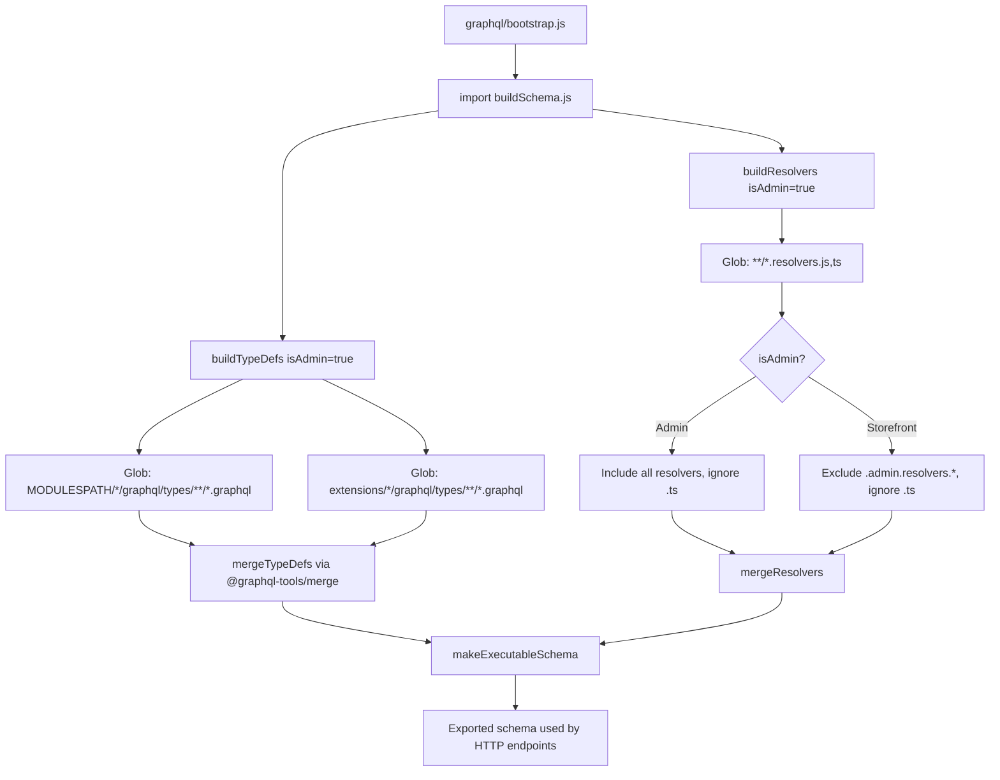
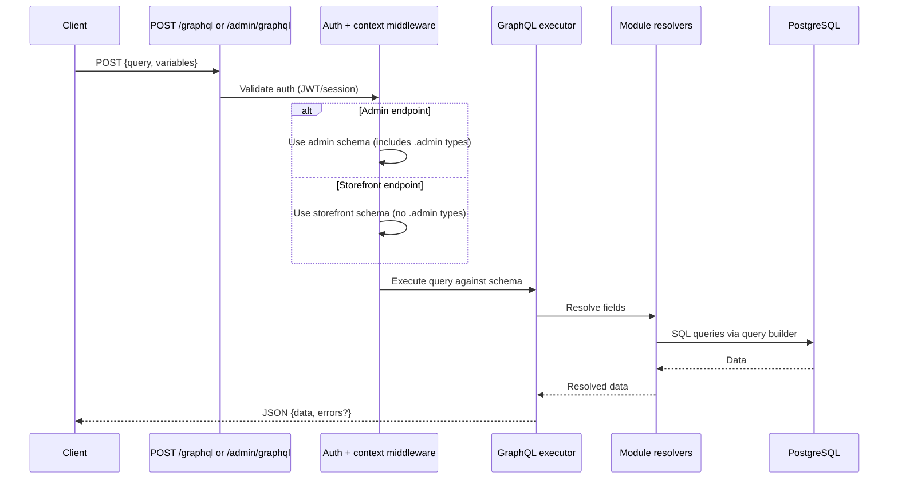
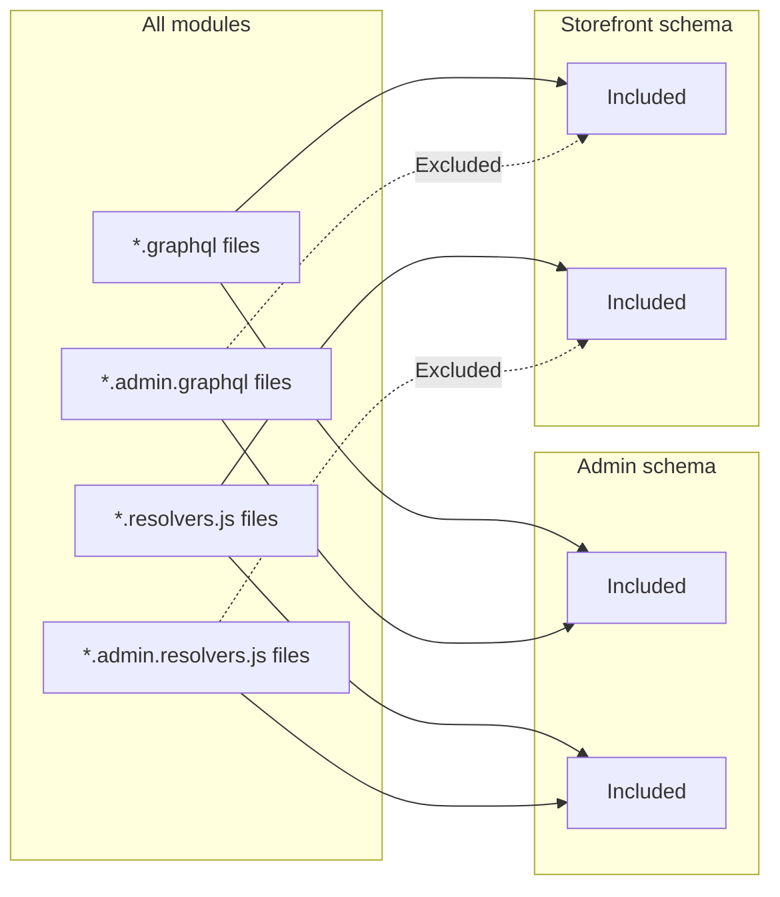

# Module: `graphql`

## Purpose

The **graphql** module is **infrastructure**, not the business domain: it **aggregates** `.graphql` documents and **resolver modules** from all core modules and enabled **extensions**, builds an **executable schema**, and (via `services/buildSchema.js`) exposes helpers such as **`rebuildSchema`** for dynamic reload scenarios.

## How it works

1. **Type definitions** — `buildTypeDefs(isAdmin)` globs `MODULESPATH/*/graphql/types/**/*.graphql` plus each extension path, merges with `@graphql-tools/merge`, and **excludes `*.admin.graphql`** when `isAdmin === false` so the storefront schema stays smaller and safer.

2. **Resolvers** — `buildResolvers(isAdmin)` globs `*.resolvers.{js,ts}` with different ignore rules:

   - **Admin** — ignores `.ts` (expects compiled `.js` in production merge step; dev can import `.ts` via dynamic import path).
   - **Storefront** — ignores `.admin.resolvers.js` / `.admin.resolvers.ts`.

3. **Bootstrap** — `bootstrap.js` side-effect imports `buildSchema.js`, which eagerly builds the **admin** schema (`buildResolvers(true)`). Separate server or entrypoints may build storefront schemas with `isAdmin: false` (see HTTP handlers that serve GraphQL).

4. **Extensions** — `getEnabledExtensions()` adds paths to both globs so extensions behave like core modules.

## Framework implementation

| Mechanism | Location |
|-----------|----------|
| Type merge | `modules/graphql/services/buildTypes.js` — `buildTypeDefs` |
| Resolver merge | `modules/graphql/services/buildResolvers.js` — `buildResolvers` |
| Executable schema | `modules/graphql/services/buildSchema.js` — `makeExecutableSchema`, `rebuildSchema` |
| Bootstrap | `modules/graphql/bootstrap.js` |

## HTTP APIs

| Route | Method | Path | Role |
|-------|--------|------|------|
| `graphql` | GET, POST | `/graphql` | Storefront GraphQL endpoint |
| `adminGraphql` | GET, POST | `/admin/graphql` | Admin GraphQL endpoint (includes `.admin` types) |

## Database tables

**None.** The graphql module has no migrations — it is pure infrastructure.

## GraphQL types

| Type | File | Scope | Query fields |
|------|------|-------|-------------|
| `Query` (root) | `Query.graphql` | Shared | `hello` (root type that all modules extend) |

All other modules contribute types by placing `.graphql` files and `.resolvers.js` under their own `graphql/types/` directories; this module merges them.

## User flows

### Schema build process (startup)

### GraphQL request flow

### Schema split: admin vs storefront

## What could be done better

- **Admin vs storefront clarity** — `.admin.graphql` / `.admin.resolvers` convention is easy to violate; a CI check that fails if admin-only fields leak into storefront typeDefs would help.

- **TypeScript resolver story** — Production ignores `.ts` in some branches; document the required **compile** step for resolver `.ts` files so extensions do not break deploys.

- **Schema size and cold start** — Large merges cost startup time; optional lazy loading or subgraphs (federation) could help very large installs.

- **Deprecation policy** — GraphQL `@deprecated` on fields with migration notes helps theme and extension authors.

- **Persisted queries / complexity limits** — For public storefront endpoints, query depth/complexity limits mitigate abuse.
