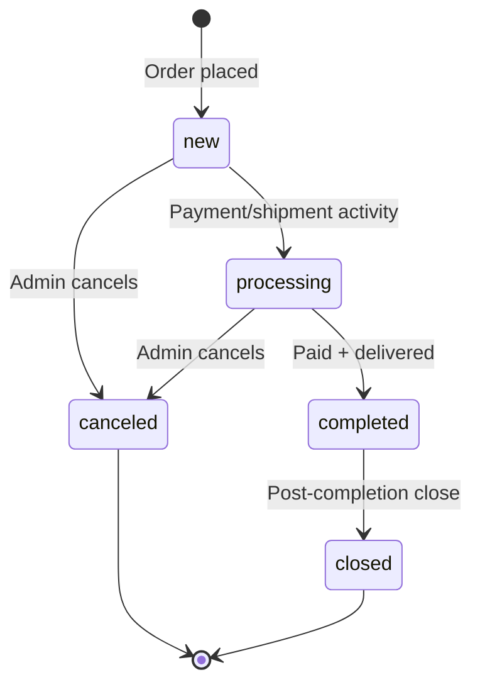
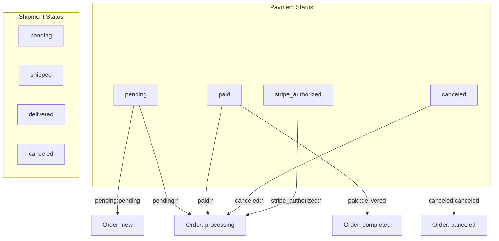
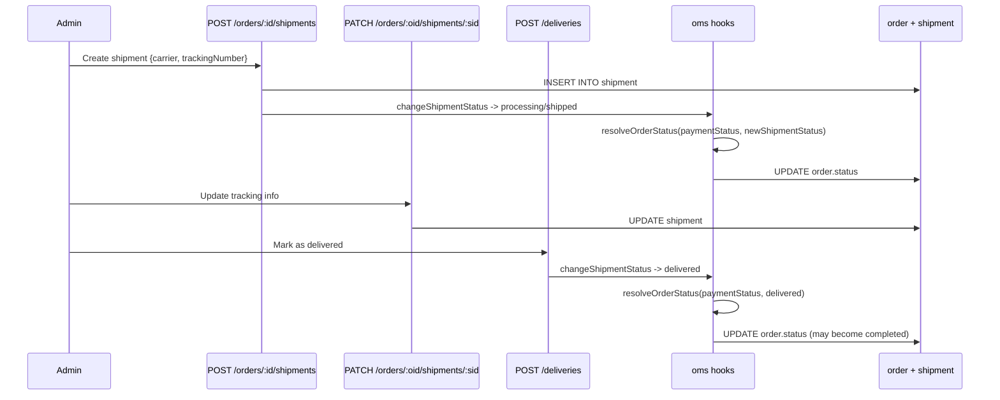
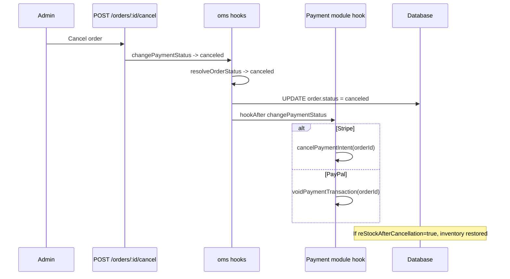

# Module: `oms` (order management)

## Purpose

**oms** is the **operational order lifecycle**: shipment and payment **status machines**, aggregate **order status** (`new`, `processing`, `completed`, `canceled`, `closed`), **mapping rules** (`psoMapping`) from payment/shipment pairs → order status, **carriers** metadata (labels, tracking URLs), **order collection filters**, and **hooks** that run when orders are saved or statuses change.

It bridges **checkout** (create/save order) with fulfillment: creating shipments for virtual orders, updating shipment status, and keeping order status coherent.

## How it works

1. **Configuration as data** — Bootstrap merges a large `oms` section into `configurationSchema` and seeds `config.util.setModuleDefaults('oms', ...)` with:

   - `order.shipmentStatus` and `order.paymentStatus` definitions (name, badge, defaults, cancel flags).
   - `order.status` graph (allowed `next` transitions).
   - `order.psoMapping` — string keys like `'paid:delivered'` mapping to aggregate statuses.
   - `order.reStockAfterCancellation`.
   - `carriers` — named carriers with `trackingUrl` templates.

2. **Payment integrations** — **stripe** adds more `paymentStatus` entries and `psoMapping` keys via its own `setModuleDefaults('oms', ...)` (merged at runtime by config).

3. **List filters** — `orderCollectionFilters` processors + pagination.

4. **Hooks** — `hookAfter('changePaymentStatus', ...)` and `hookAfter('changeShipmentStatus', ...)` call `resolveOrderStatus` and `changeOrderStatus`, with guards against illegal transitions from `canceled` / `closed`.

5. **Virtual products** — `hookAfter('saveOrder', ...)` — if `order.no_shipping_required`, creates a shipment and marks it `delivered` automatically.

6. **Services** — `createShipment`, `updateOrderStatus`, `updateShipmentStatus`, etc., underpin admin and API flows.

## Framework implementation

| Mechanism | Location |
|-----------|----------|
| Bootstrap | `modules/oms/bootstrap.ts` — schema merge, defaults, hooks, filters |
| Status resolution | `services/updateOrderStatus.js` |
| Shipments | `services/createShipment.js`, `updateShipmentStatus.js` |
| Checkout coupling | Hooks reference `SaveOrderContext`, `CreateOrderResult`, `SaveOrderArgs` from `checkout/services/orderCreator.js` |

## HTTP APIs

| Route | Method | Path | Role |
|-------|--------|------|------|
| `createShipment` | POST | `/orders/:id/shipments` | Create shipment for order |
| `updateShipment` | PATCH | `/orders/:order_id/shipments/:shipment_id` | Update shipment (tracking, carrier) |
| `markDelivered` | POST | `/deliveries` | Mark shipment delivered |
| `cancelOrder` | POST | `/orders/:id/cancel` | Cancel order |
| `salestatistic` | GET | `/salestatistic` | Sales statistics (admin dashboard) |
| `lifetimesales` | GET | `/lifetimesales` | Lifetime sales summary |
| `orderGrid` | GET | `/orders` | Admin order list page |
| `orderEdit` | GET | `/order/edit/:id` | Admin order detail page |

## Database tables

OMS **does not create** its own tables — it **alters** tables owned by **checkout**:

| Table | Migration | Change |
|-------|-----------|--------|
| `order` | `Version-1.0.0`, `Version-1.0.1` | Add `shipment_status`, `payment_status`, `status` columns |
| `shipment` | `Version-1.0.0` | Rename `carrier_name` → `carrier` |
| `order_item`, `order` | `Version-1.0.2` | Add `no_shipping_required` column |

## GraphQL types

| Type | File | Scope | Query fields |
|------|------|-------|-------------|
| `Order`, `OrderAddress`, `OrderItem`, `Activity`, `Shipment` | `Order.graphql` | Shared | `order` |
| `OrderCollection` | `Order.admin.graphql` | Admin | `orders` |
| `Status`, `PaymentStatus`, `ShipmentStatus` | `Status.graphql` | Shared | `statusList`, `paymentStatusList`, `shipmentStatusList` |
| `PaymentTransaction` | `PaymentTransaction.admin.graphql` | Admin | *(extends Order)* |
| `Carrier` | `Carrier.admin.graphql` | Admin | `carriers` |
| `BestSeller` | `BestSeller.admin.graphql` | Admin | `bestSellers` |

## User flows

### Order status state machine

### Payment + shipment status mapping (psoMapping)

### Shipment lifecycle (admin)

### Cancel order

## What could be done better

- **Config complexity** — `oms.order` is powerful but dense; a visual state machine doc or validator that rejects impossible `psoMapping` keys at startup would help.

- **Multi-shipment orders** — Auto-deliver for `no_shipping_required` is one path; partial shipments and split fulfillments may need richer modeling.

- **Returns and refunds** — Stripe statuses hint at refunds; a unified return merchandise flow may span **oms** + **stripe** + inventory.

- **Hook ordering** — Multiple `hookAfter('changePaymentStatus')` listeners (oms + paypal + stripe) rely on clear non-interference; document cancellation vs void ordering.

- **Observability** — Emit domain events (or structured logs) on every status transition for audit trails and external WMS integration.
