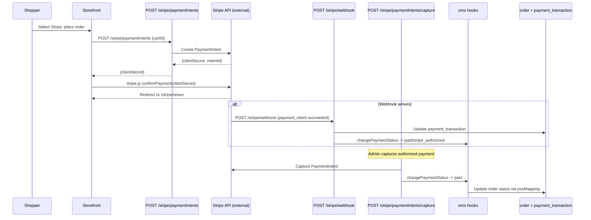
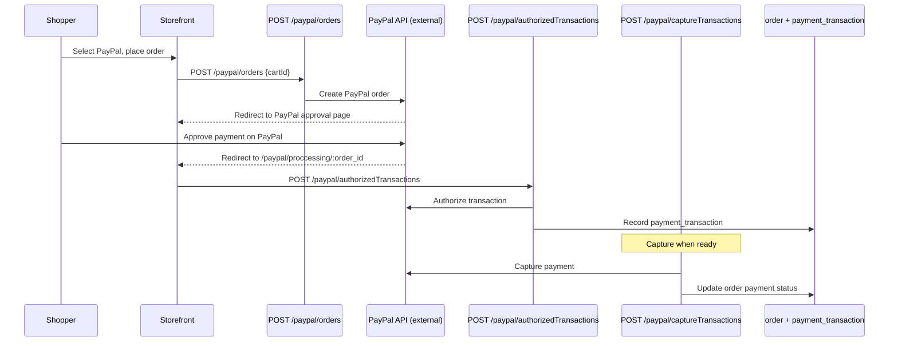
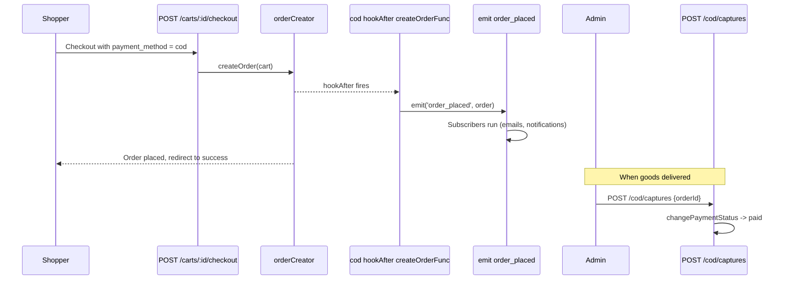
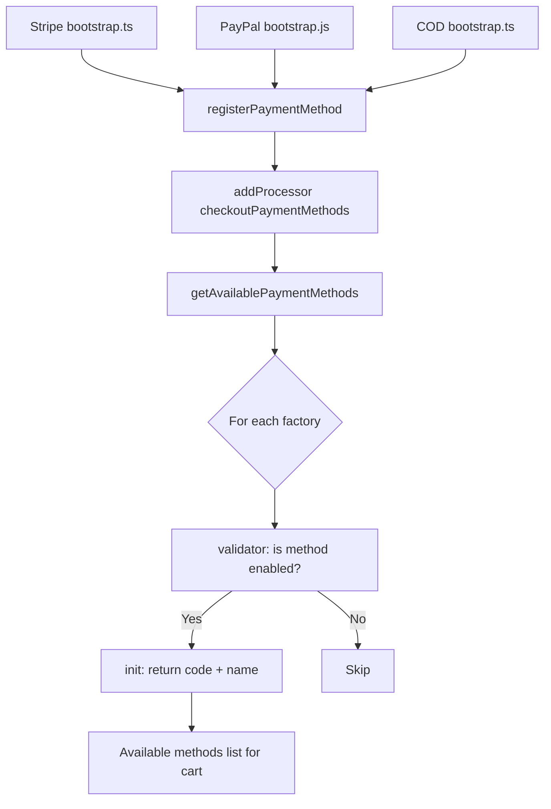

# Modules: `stripe`, `paypal`, `cod` (payment methods)

## Purpose

These modules **do not replace checkout**; they **plug into** checkout’s payment registry and **oms** lifecycle hooks. Each registers a **payment method** (`code`, display `name`) and optional **cleanup** when payment status becomes `canceled`.

| Module | Method code | Typical flow |
|--------|-------------|--------------|
| **stripe** | `stripe` | Card/wallet via Stripe; extra **payment statuses** for authorized/refunded states; cancels PaymentIntent on cancel |
| **paypal** | `paypal` | PayPal transaction; voids on cancel |
| **cod** | `cod` | Cash on delivery; after order save with COD, emits `order_placed` event |

## How it works

### Shared pattern (`registerPaymentMethod`)

All three call `registerPaymentMethod` from `checkout/services/getAvailablePaymentMethods.ts`, which `addProcessor('checkoutPaymentMethods', ...)` to append a factory:

- **`init`** — Returns `{ code, name }`. Display names often come from **setting** keys (`getSetting('stripeDisplayName', 'Stripe')`, etc.).
- **`validator`** — Returns whether the method should appear (checks `getConfig('system.<gateway>', {})` and falls back to `getSetting('...PaymentStatus', 0)`).

Checkout gathers enabled methods via `getAvailablePaymentMethods()`.

### Stripe-specific

- Merges **oms** defaults for Stripe payment statuses and **psoMapping** (maps payment/shipment status pairs to high-level order status).
- `hookAfter('changePaymentStatus', ...)` — when status is `canceled` and `order.payment_method === 'stripe'`, calls `cancelPaymentIntent(orderID)`.

### PayPal-specific

- `hookAfter('changePaymentStatus', ...)` for `paypal` → `voidPaymentTransaction(orderID)`.

### COD-specific

- No extra oms status merge in bootstrap (unlike Stripe).
- `hookAfter('createOrderFunc', ...)` — if `payment_method === 'cod'`, `emit('order_placed', order)` for subscribers (e.g. emails, ERP).

## Framework implementation

| Module | Bootstrap | Notable services |
|--------|-----------|------------------|
| stripe | `bootstrap.ts` | `cancelPayment.js`, setting/config gate |
| paypal | `bootstrap.js` | `voidPaymentTransaction.js` |
| cod | `bootstrap.ts` | hooks + `emit` |

GraphQL and REST pieces for each gateway live under the respective `modules/<name>/` trees (capture, webhooks, admin settings).

## HTTP APIs

### Stripe

| Route | Method | Path | Role |
|-------|--------|------|------|
| `createPaymentIntent` | POST | `/stripe/paymentIntents` | Create Stripe PaymentIntent |
| `capturePaymentIntent` | POST | `/stripe/paymentIntents/capture` | Capture authorized payment |
| `refundPaymentIntent` | POST | `/stripe/paymentIntents/refund` | Refund payment |
| `stripeWebHook` | POST | `/stripe/webhook` | Stripe webhook receiver |
| `stripeReturn` | GET | `/stripe/return` | Post-payment redirect page |

### PayPal

| Route | Method | Path | Role |
|-------|--------|------|------|
| `paypalCreateOrder` | POST | `/paypal/orders` | Create PayPal order |
| `paypalAuthorizePayment` | POST | `/paypal/authorizedTransactions` | Authorize transaction |
| `paypalCapturePayment` | POST | `/paypal/captureTransactions` | Capture payment |
| `paypalCaptureAuthorizedPayment` | POST | `/paypal/authorizations/capture` | Capture authorized payment |
| `paypalReturn` | GET | `/paypal/proccessing/:order_id` | Post-payment redirect |
| `paypalCancel` | GET | `/paypal/cancelling/:order_id` | Cancellation redirect |

### COD

| Route | Method | Path | Role |
|-------|--------|------|------|
| `codCapturePayment` | POST | `/cod/captures` | Mark COD payment captured |

## Database tables

**None.** All three payment modules have **no migration files**. They rely on:
- `payment_transaction` table (owned by **checkout**)
- `order` table columns like `payment_method`, `payment_status` (owned by **checkout** + **oms**)
- `setting` table (owned by **setting**) for display names and enabled flags

## GraphQL types

| Type | File | Scope | Query fields |
|------|------|-------|-------------|
| `StripeSetting` | `StripeSetting.graphql` / `.admin` | Shared + Admin | *(extends Setting)* |
| `PaypalSetting` | `PaypalSetting.graphql` / `.admin` | Shared + Admin | *(extends Setting)* |
| `CODSetting` | `CODSetting.graphql` | Shared | *(extends Setting)* |

All payment settings are surfaced through the `setting` query, not separate root queries.

## User flows

### Stripe payment flow

### PayPal payment flow

### COD payment flow

### Payment method registration (internal)

## What could be done better

- **Config vs setting duplication** — `validator` branches on `system.stripe.status` vs `getSetting('stripePaymentStatus')`; consolidating to one source of truth (or documenting precedence) avoids “enabled in DB but not in file” confusion.

- **Error surfaces** — Cancel/void failures in hooks should surface structured logs and optionally admin-visible flags for support.

- **Webhook idempotency** — Payment gateways need idempotent webhook handlers; ensure order status transitions are safe under retry.

- **COD events** — Only COD emits `order_placed` in this hook; other methods might need the same event for consistent automation—verify subscriber assumptions.

- **Testing** — Contract tests against Stripe/PayPal sandboxes are slow but valuable; stubbed integration tests for `registerPaymentMethod` validators are quick wins.
