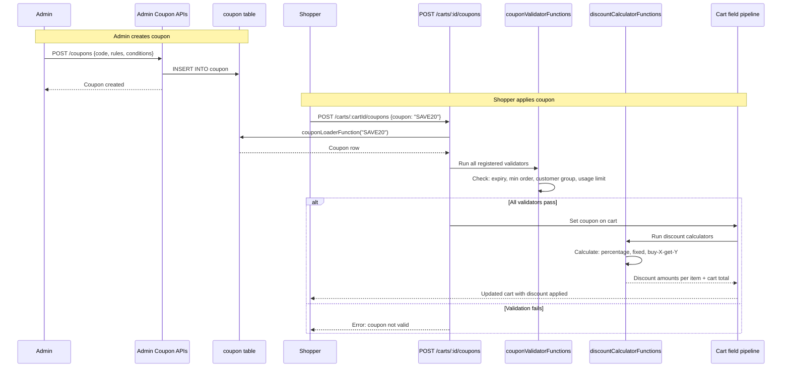
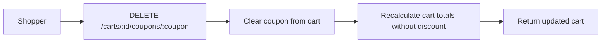

# Module: `promotion`

## Purpose

**promotion** implements **coupons** and **cart-level discounting**: loading coupons by code, attaching promotion-related **cart and cart-item fields**, pluggable **coupon validators** and **discount calculators**, and admin collection filters for coupon grids.

## How it works

1. **Coupon loader** — `couponLoaderFunction` processor provides `async (couponCode) => row` using the query builder against the `coupon` table.

2. **Cart integration** — `registerCartPromotionFields` and `registerCartItemPromotionFields` run at defined priorities (`cartItemFields` at priority `11`, after base/catalog layers) so discounts see line prices and customer context.

3. **Extensibility** — `couponValidatorFunctions` and `discountCalculatorFunctions` processors let extensions add rules (e.g. customer group, minimum spend) and calculation strategies without editing core discount code.

4. **Admin** — GraphQL types and resolvers for coupons; collection filters mirror other modules.

5. **Persistence** — Migrations define coupon tables and relationships.

## Framework implementation

| Mechanism | Location |
|-----------|----------|
| Bootstrap | `modules/promotion/bootstrap.js` |
| Cart fields | `services/registerCartPromotionFields.js`, `registerCartItemPromotionFields.js` |
| Validators/calculators | `registerDefaultValidators.js`, `registerDefaultCalculators.js` |
| Coupon filters | `registerDefaultCouponCollectionFilters.js` |

**customer** supplies group/email fields on the cart; **promotion** validators should read those fields for targeting.

## HTTP APIs

| Route | Method | Path | Role |
|-------|--------|------|------|
| `createCoupon` | POST | `/coupons` | Admin: create coupon |
| `updateCoupon` | PATCH | `/coupons/:id` | Admin: edit coupon |
| `deleteCoupon` | DELETE | `/coupons/:id` | Admin: remove coupon |
| `couponApply` | POST | `/carts/:cart_id/coupons` | Storefront: apply coupon to cart |
| `couponRemove` | DELETE | `/carts/:cart_id/coupons/:coupon` | Storefront: remove coupon from cart |
| `couponNew` | GET | `/coupon/new` | Admin page |
| `couponGrid` | GET | `/coupons` | Admin page |
| `couponEdit` | GET | `/coupon/edit/:id` | Admin page |

## Database tables

| Table | Migration | Role |
|-------|-----------|------|
| `coupon` | `Version-1.0.0` (create), `Version-1.0.1` (alter: columns → `jsonb`) | Coupon definitions, rules, conditions |

## GraphQL types

| Type | File | Scope | Query fields |
|------|------|-------|-------------|
| scalar `JSON` | `Coupon.graphql` | Shared | *(extends Cart: `applyCouponApi`, `removeCouponApi`)* |
| `Coupon`, `CouponCollection`, `TargetProducts`, `OrderCondition`, `ByXGetY`, `UserCondition` | `Coupon.admin.graphql` | Admin | `coupon`, `coupons` |

## User flows

### Coupon lifecycle (admin + storefront)

### Remove coupon

## What could be done better

- **Ordering documentation** — Priority `11` on item fields is magic; a named constant or enum in one shared module would make merge conflicts easier to reason about.

- **Test matrix** — Discount stacking, tax-inclusive vs exclusive prices, and rounding interact with **tax** and **catalog** `pricing`; a documented golden-file test set reduces regressions.

- **Automatic promotions** — If the platform wants “rules without coupon codes”, a parallel registry path (rule engine) could sit beside `couponValidatorFunctions`.

- **Audit trail** — Storing applied discount breakdown on the order at placement time helps OMS and customer service; confirm this is persisted vs recomputed.
