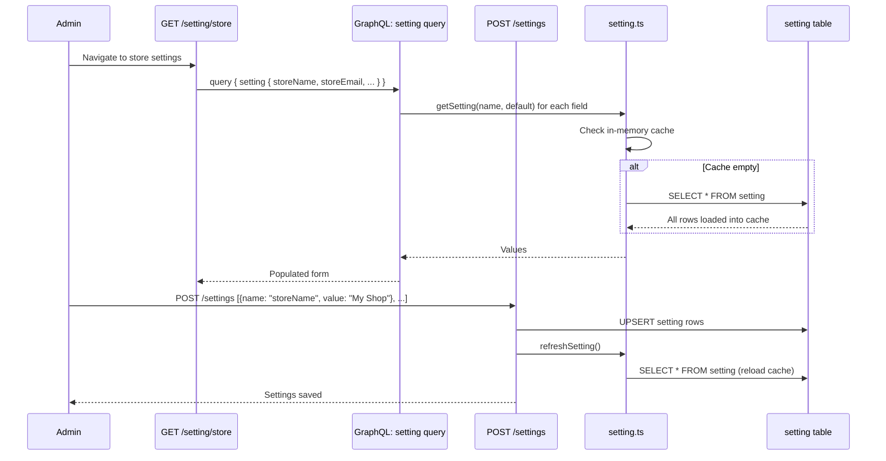
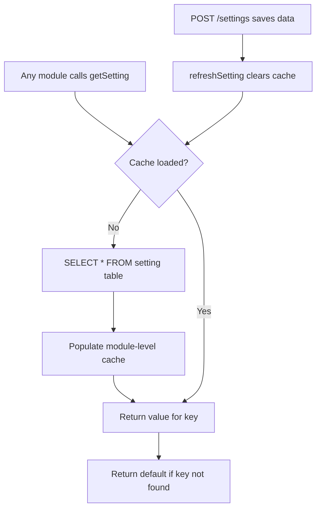

# Module: `setting`

## Purpose

**setting** persists **key/value store configuration** in the `setting` database table and exposes it to **admin** (store and payment settings UI), **GraphQL**, and the **`getSetting` service** used across modules (payment display names, feature flags, store contact info).

Unlike modules with a **bootstrap** file, **setting** has **no `bootstrap.js`**: it is loaded as a core module path but relies on routes, GraphQL, and services only.

## How it works

1. **Read path** — `services/setting.ts` loads all rows once into a module-level cache (`let setting`), `getSetting(name, defaultValue)` lookups, and `refreshSetting()` to invalidate after saves.

2. **Write path** — `api/saveSetting` with auth middleware persists changes; admin React pages (`storeSetting`, `paymentSetting`) drive the UX.

3. **GraphQL** — `Setting`, `StoreSetting`, `ShippingSetting` types expose values to admin clients.

4. **Migrations** — Initial `setting` table and seeds if any.

## Framework implementation

| Mechanism | Location |
|-----------|----------|
| Service API | `modules/setting/services/setting.ts` — `getSetting`, `refreshSetting`, helpers |
| HTTP | `api/saveSetting/*` |
| Admin UI | `pages/admin/storeSetting`, `paymentSetting`, menu components |
| GraphQL | `graphql/types/Setting/*`, `StoreSetting/*`, `ShippingSetting/*` |

**Payment modules** combine `getConfig('system.*')` with `getSetting('*Status')` to decide visibility—a coupling worth understanding when deploying.

## HTTP APIs

| Route | Method | Path | Role |
|-------|--------|------|------|
| `saveSetting` | POST | `/settings` | Persist settings (admin, auth-gated) |
| `storeSetting` | GET | `/setting/store` | Admin store settings page |
| `paymentSetting` | GET | `/setting/payments` | Admin payment settings page |

## Database tables

| Table | Migration | Role |
|-------|-----------|------|
| `setting` | `Version-1.0.0` (create) | Key/value store (name → value) for runtime config |

## GraphQL types

| Type | File | Scope | Query fields |
|------|------|-------|-------------|
| `Setting` | `Setting.graphql` | Shared | `setting` |
| `StoreSetting` | `StoreSetting.graphql` | Shared | *(extends Setting)* |
| `ShippingSetting` | `ShippingSetting.graphql` | Shared | *(extends Setting)* |

Other modules extend `Setting` with their own fields: `CheckoutSetting`, `TaxSetting`, `StripeSetting`, `PaypalSetting`, `CODSetting`.

## User flows

### Admin updates store settings

### Setting read flow (used by other modules)

## What could be done better

- **Cache invalidation** — Module-global cache is fast but must stay correct across processes (single Node assumption). Multi-instance deployments need Redis/external cache or DB read per request with TTL.

- **Typing** — `value` is `unknown`; a typed registry (per-key Zod/schema) would catch bad types at save time.

- **Secrets** — Ensure API keys are not stored in `setting` if rows are broadly readable via GraphQL; prefer `system.*` config or a secrets backend.

- **Bootstrap optional hook** — A tiny `bootstrap.js` could call `refreshSetting` on worker startup for clearer lifecycle even if not strictly required.

- **Audit** — Admin changes to settings should log **who** changed **what** for compliance.
