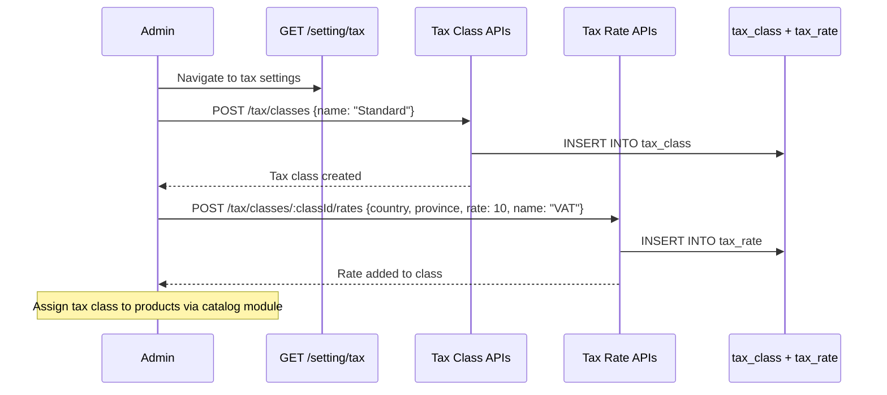
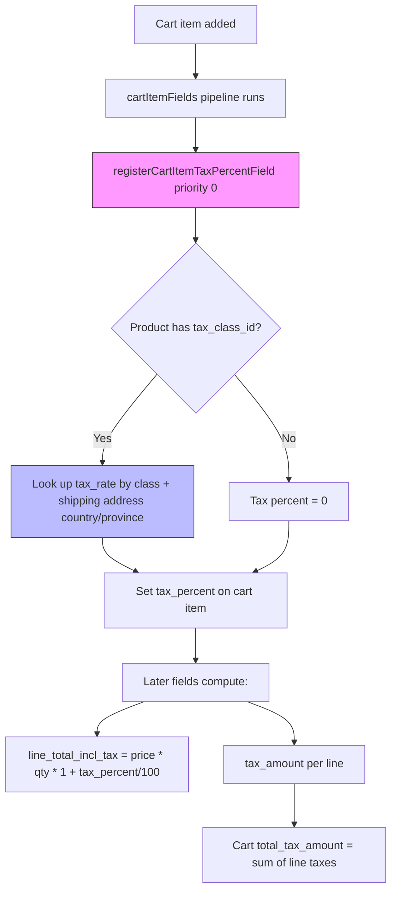
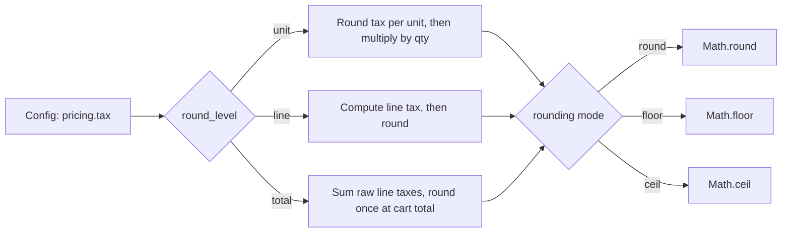

# Module: `tax`

## Purpose

**tax** adds **tax class** administration, **per line-item tax percentage** resolution on the cart, and **pricing.tax** configuration (rounding mode, precision, round at line vs unit vs total, and whether catalog prices include tax).

## How it works

1. **Cart item field** — `registerCartItemTaxPercentField` attaches at priority `0` on `cartItemFields` so tax can be computed early in the pipeline relative to other item fields (promotion uses `11`; exact interactions depend on field ordering after `sortFields`).

2. **Configuration** — Merges `pricing.tax` into `configurationSchema` and sets `config.util.setModuleDefaults('pricing', { tax: ... })` with defaults such as `price_including_tax: true`.

3. **Admin lists** — `taxClassCollectionFilters` + pagination filters for GraphQL tax class queries.

4. **GraphQL + migrations** — Tax classes and rules stored in Postgres; types exposed for admin.

## Framework implementation

| Mechanism | Location |
|-----------|----------|
| Bootstrap | `modules/tax/bootstrap.js` |
| Item field | `services/registerCartItemTaxPercentField.js` |
| Filters | `registerDefaultTaxClassCollectionFilters.js` |

**catalog** sets general `pricing.rounding` / `precision`; **tax** nests tax-specific behavior under `pricing.tax`.

## HTTP APIs

| Route | Method | Path | Role |
|-------|--------|------|------|
| `createTaxClass` | POST | `/tax/classes` | Create tax class |
| `updateTaxClass` | PATCH | `/tax/classes/:id` | Edit tax class |
| `createTaxRate` | POST | `/tax/classes/:class_id/rates` | Add rate to class |
| `updateTaxRate` | PATCH | `/tax/rates/:id` | Edit rate |
| `deleteTaxRate` | DELETE | `/tax/rates/:id` | Remove rate |
| `taxSetting` | GET | `/setting/tax` | Admin settings page |

## Database tables

| Table | Migration | Role |
|-------|-----------|------|
| `tax_class` | `Version-1.0.0` | Tax class definitions |
| `tax_rate` | `Version-1.0.0` | Rate rules (country, province, percentage) per class |

Also alters `product` table to add FK `FK_TAX_CLASS` → `tax_class`.

## GraphQL types

| Type | File | Scope | Query fields |
|------|------|-------|-------------|
| `TaxSetting` | `TaxSetting.graphql` / `.admin` | Shared + Admin | *(extends Setting)* |
| `TaxClass`, `TaxRate`, `TaxClassCollection` | `TaxClass.admin.graphql` | Admin | `taxClasses`, `taxClass` |

## User flows

### Tax configuration (admin)

### Tax calculation in cart pipeline

### Tax rounding behavior

## What could be done better

- **Field priority semantics** — Document the intended order: base price → tax → promotions or the reverse, depending on business rules; mismatches here cause real money bugs.

- **Jurisdictional complexity** — US sales tax, EU VAT, and GST often need address + product class matrix; the module may need plugin hooks beyond a single percentage field.

- **Display vs calculation** — Storefront “including tax” labeling should align with `price_including_tax`; centralize formatting helpers to avoid drift across themes.

- **Integration tests** — Property-style tests for rounding (`round_level`: unit/line/total) catch floating-point issues.
